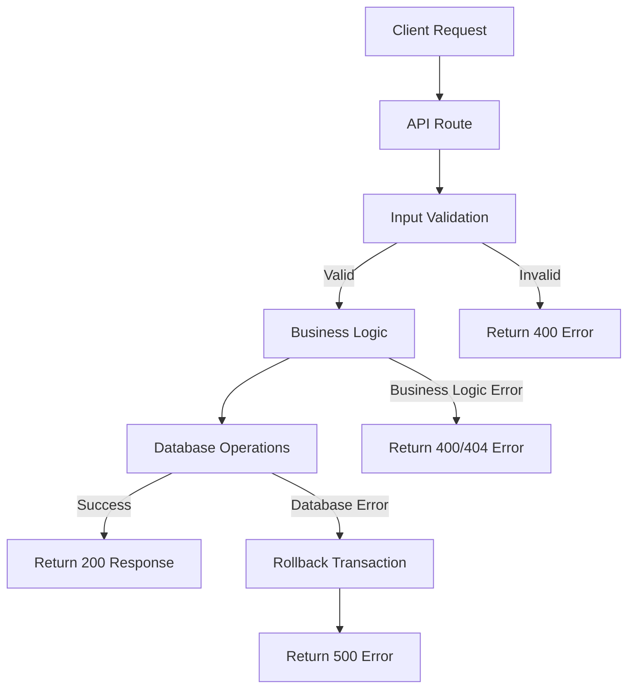

# Critical Error Identification and Fixes

## Overview

This document identifies critical logic and syntax errors in the safeguardnavigators codebase and provides recommendations for fixing them. The analysis covers both frontend (TypeScript/React) and backend (Python/FastAPI) components.

## Repository Type

Full-Stack Application using Next.js (frontend) and FastAPI (backend)

## Critical Errors Identified

### 1. Error Handling Issues

#### Problem
Inconsistent error handling patterns across the codebase with potential unhandled exceptions.

#### Examples
1. In `backend/app/api/auth.py`, generic `except Exception as e` blocks catch all exceptions but may hide specific error types:
   ```python
   except Exception as e:
       db.rollback()
       return {"success": False, "message": f"Error during registration: {str(e)}"}
   ```

2. In frontend components like `components/SafetyMap.tsx`, error handling sometimes doesn't properly check error types:
   ```typescript
   catch (err: unknown) {
     console.error('Error fetching safety data:', err);
     if (err instanceof Error) {
       setError(err.message);
     }
     setIsLoading(false);
   }
   ```

#### Fix Recommendations
1. Replace generic exception handling with specific exception types where possible
2. Log detailed error information for debugging
3. Implement proper error boundaries in React components
4. Standardize error response formats across API endpoints

### 2. Potential Null/Undefined Reference Issues

#### Problem
Potential null/undefined reference errors in frontend components that access object properties without proper checks.

#### Examples
1. In `app/about/page.tsx`, direct array access without checking if index exists:
   ```typescript
   {teamMembers[3].name.split(' ').map(n => n[0]).join('')}
   ```

2. In various components, accessing properties of potentially null objects without checks.

#### Fix Recommendations
1. Add proper null/undefined checks before accessing object properties
2. Use optional chaining (?.) operator where applicable
3. Provide default values for potentially missing data

### 3. Async/Await Error Handling

#### Problem
Inconsistent handling of async/await errors, particularly in useEffect hooks and API calls.

#### Examples
1. In `components/SafetyReporting.tsx`, some async functions in useEffect don't properly handle all error paths.

#### Fix Recommendations
1. Ensure all async operations in useEffect have proper try/catch blocks
2. Handle promise rejections appropriately
3. Cancel ongoing requests when components unmount to prevent memory leaks

### 4. Type Safety Issues

#### Problem
Some TypeScript code lacks proper type definitions, leading to potential runtime errors.

#### Examples
1. Use of `any` type in various API responses
2. Inconsistent typing in state management

#### Fix Recommendations
1. Replace `any` types with specific interfaces
2. Define proper TypeScript interfaces for API responses
3. Use strict TypeScript compiler options

### 5. Database Transaction Handling

#### Problem
Database transactions in backend code may not be properly rolled back in all error scenarios.

#### Examples
1. In `backend/app/api/auth.py`, database rollback is called but might not cover all failure cases.

#### Fix Recommendations
1. Ensure all database operations are wrapped in proper transaction blocks
2. Implement comprehensive rollback mechanisms
3. Add proper logging for database operations

## Architecture

### Error Handling Architecture

The application should implement a consistent error handling strategy:

1. **Frontend Error Boundaries**
   - Implement React error boundaries for catching UI rendering errors
   - Use centralized error handling for API calls
   - Display user-friendly error messages

2. **Backend Error Handling**
   - Standardize API error response formats
   - Implement proper logging for debugging
   - Use HTTP status codes appropriately

### Data Flow for Error Handling



## API Endpoints Reference

### Authentication Endpoints

#### POST /api/auth/register
- **Request Schema**: 
  ```typescript
  {
    email: string;
    password: string;
    firstName: string;
    lastName: string;
  }
  ```
- **Response Schema**:
  ```typescript
  {
    success: boolean;
    message: string;
    user?: User;
    errors?: Record<string, string>;
  }
  ```

#### POST /api/auth/login
- **Request Schema**:
  ```typescript
  {
    email: string;
    password: string;
  }
  ```
- **Response Schema**:
  ```typescript
  {
    success: boolean;
    message: string;
    user?: User;
    token?: string;
    errors?: Record<string, string>;
  }
  ```

### Emergency Endpoints

#### POST /api/emergency/alert
- **Request Schema**:
  ```typescript
  {
    location: {
      latitude: number;
      longitude: number;
    };
    emergencyType: string;
    severity: number;
    description?: string;
  }
  ```
- **Response Schema**:
  ```typescript
  {
    success: boolean;
    message: string;
    alertId?: string;
    errors?: Record<string, string>;
  }
  ```

## Data Models

### User Model
```typescript
interface User {
  id: string;
  email: string;
  firstName: string;
  lastName: string;
  displayName?: string;
  phone?: string;
  avatar?: string;
  language: string;
  userType: string;
  role: string;
  emailVerified: boolean;
  city?: string;
  state?: string;
  createdAt: Date;
  lastLoginAt?: Date;
}
```

### Emergency Alert Model
```typescript
interface EmergencyAlert {
  id: string;
  userId: string;
  location: {
    latitude: number;
    longitude: number;
  };
  emergencyType: string;
  severity: number;
  description?: string;
  status: 'pending' | 'responding' | 'resolved';
  timestamp: Date;
  estimatedResponseTime?: number;
}
```

## Business Logic Layer

### Authentication Service
Handles user registration, login, and session management with proper error handling.

### Emergency Service
Manages emergency alerts, notifications, and integration with emergency services.

### Error Handling Service
Centralized service for consistent error handling across the application.

## Middleware & Interceptors

### Error Handling Middleware
Intercepts errors and formats them into consistent responses.

### Authentication Middleware
Validates user authentication and handles unauthorized access.

## Testing

### Unit Tests for Error Handling

1. **Frontend Component Tests**
   - Test error boundary components
   - Test API error handling in components
   - Test loading and error states

2. **Backend API Tests**
   - Test error responses for invalid inputs
   - Test database error handling
   - Test authentication error cases

### Integration Tests

1. **Authentication Flow**
   - Test registration with invalid data
   - Test login with incorrect credentials
   - Test session management

2. **Emergency Alert Flow**
   - Test alert creation with invalid data
   - Test alert resolution process
   - Test emergency service integration

## Fixes Implementation Plan

### Phase 1: Error Handling Standardization
1. Implement consistent error response formats across all API endpoints
2. Add proper error boundaries in React components
3. Standardize logging across backend services

### Phase 2: Type Safety Improvements
1. Replace `any` types with specific interfaces
2. Add proper TypeScript interfaces for all API responses
3. Enable strict TypeScript compiler options

### Phase 3: Null/Undefined Protection
1. Add proper null/undefined checks throughout the codebase
2. Use optional chaining operator where applicable
3. Implement default values for potentially missing data

### Phase 4: Database Transaction Safety
1. Ensure all database operations use proper transactions
2. Implement comprehensive rollback mechanisms
3. Add proper logging for database operations

## Conclusion

The safeguardnavigators codebase has several critical error handling issues that need to be addressed to improve reliability and maintainability. By implementing the recommended fixes, the application will have more robust error handling, better type safety, and improved overall stability.