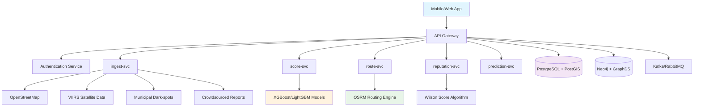
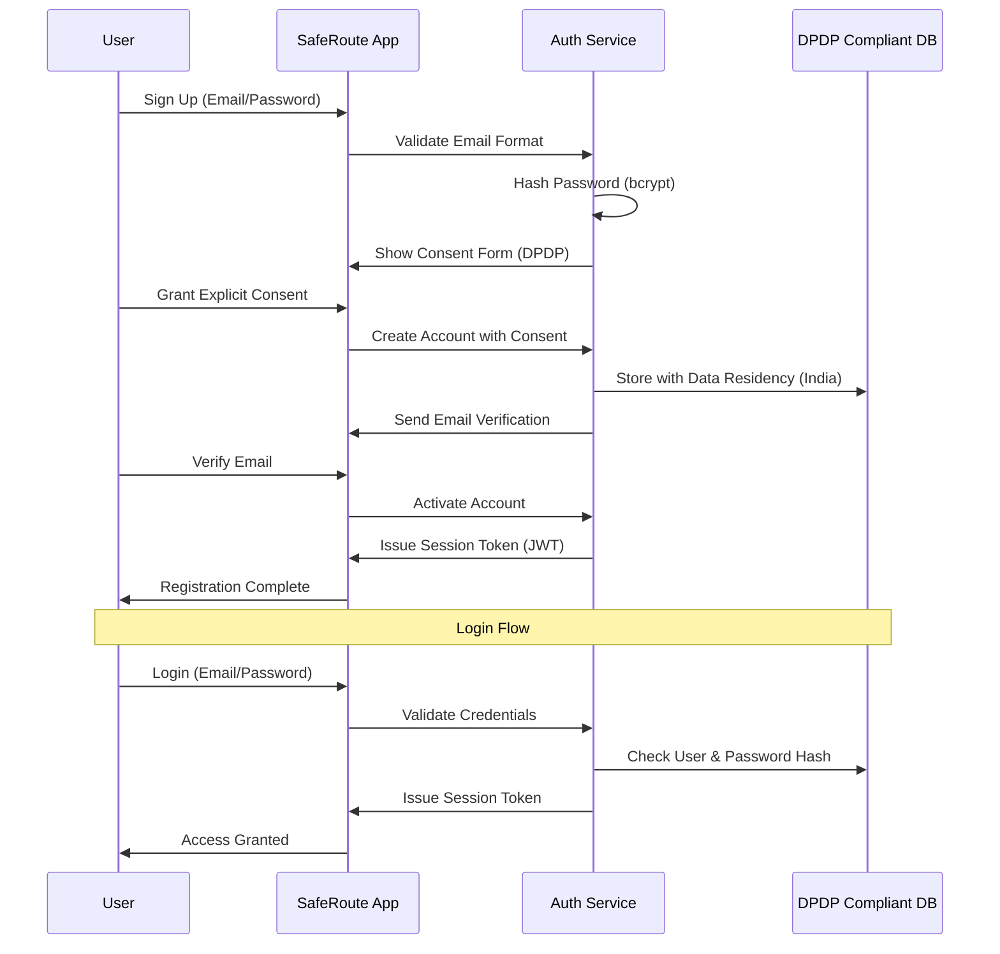
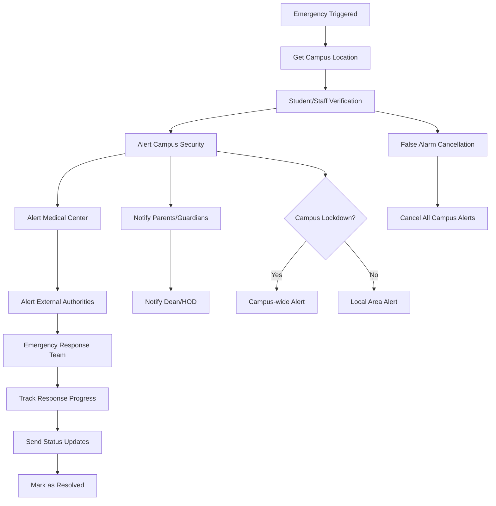
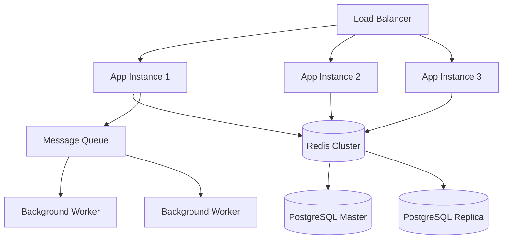

# SafeRoute: AI-Driven Public Safety Navigation System - Implementation Design

## Overview

**Project Context**: SafeRoute is an AI-driven public safety navigation system designed for the Infosys PALS TechZooka Hackathon 2025. This project focuses on building intelligent navigation for pedestrians and two-wheeler riders in Indian cities, prioritizing safety over speed.

**Team**: SafeGuard Navigators
- Team Lead: Pranava Kumar (pranavakumar.it@gmail.com)
- Teammates: Sam Daniel J, Muhilan M
- Mentor: Mrs. Chinchu Nair (Assistant Professor, Department of CSE)

**Mission**: Building AI Runways for Safer Urban Mobility in India by addressing the road safety crisis where 65% of fatalities affect vulnerable road users (45% two-wheelers, 20% pedestrians).

**Key Statistics Driving the Solution**:
- Road Accidents (2022): 4,61,312 resulting in 1,68,491 deaths
- Night-time Fatalities in Delhi: 43% pedestrian deaths and 38% two-wheeler deaths
- Infrastructure Gaps: 4,289 "dark spots" identified in Delhi

This design document outlines the transformation from the current prototype to a production-ready system implementing the complete SafeRoute vision with real-world data integration, AI-driven safety scoring, and DPDP Act 2023 compliance.

## Technology Stack Implementation (Based on Solution Document)

### Current Stack (Existing Codebase)
- **Frontend**: Next.js 15.5.2, React 19.1.0, TypeScript
- **UI Components**: Radix UI, Tailwind CSS, Lucide React
- **Maps**: Leaflet, React-Leaflet (to be enhanced with Mappls SDK)
- **Database**: Prisma ORM, SQLite (development)
- **Authentication**: Mock client-side auth (to be replaced)
- **Real-time**: Socket.io-client v4.8.1
- **Additional Libraries**: z-ai-web-dev-sdk v0.0.10, recharts v2.15.4

### Enhanced Production Stack (Per Solution Document)
- **Frontend**: NextJS 15+, TailwindCSS v4+, Shadcn UI, Magic UI, Framer Motion
- **Backend Services**: FastAPI (Python), NestJS (TypeScript)
- **Maps & Visualization**: Mappls SDK, MapLibre GL + OSM tiles
- **Database & Geospatial**: PostgreSQL + PostGIS, Neo4j + GraphDS
- **Routing Engine**: OSRM (C++), GraphHopper (Java)
- **Machine Learning**: XGBoost/LightGBM, PyTorch
- **Data Sources**: 
  - VIIRS "Black Marble" satellite data (500m resolution)
  - OpenStreetMap + Mappls SDK
  - Municipal dark-spot inventories
  - Weather APIs, POI status, traffic conditions
- **Privacy Compliance**: DPDP Act 2023 compliant architecture
- **Real-time Processing**: Kafka/RabbitMQ for event streaming
- **Authentication**: Indian context user management with regional language support

### SafeRoute Microservices Architecture


## Authentication & Authorization System (DPDP Act 2023 Compliant)

### Standard Email/Password Authentication

Implement a DPDP Act 2023 compliant authentication system with standard sign up/sign in:

#### SafeRoute User Schema
```typescript
interface SafeRouteUser {
  id: string;
  email: string; // Primary identifier
  password: string; // Hashed password
  name: {
    first: string;
    last: string;
    preferredName?: string;
  };
  phone?: string; // Optional for emergency contacts
  demographics: {
    age?: number;
    gender?: 'male' | 'female' | 'other' | 'prefer_not_to_say';
    language: 'en' | 'ta'; // English and Tamil only
    city: string;
    state: string;
  };
  userType: 'pedestrian' | 'two_wheeler' | 'cyclist' | 'public_transport';
  safetyProfile: {
    riskTolerance: number; // 0-100 (how much safety vs speed)
    timePreference: 'safety_first' | 'balanced' | 'time_first';
    accessibilityNeeds?: AccessibilityRequirements;
    emergencyContacts: EmergencyContact[];
  };
  deviceInfo: {
    hasAccelerometer: boolean; // For pothole detection
    hasCamera: boolean; // For computer vision features
    offlineCapable: boolean;
    networkQuality: 'high' | 'medium' | 'low';
  };
  privacySettings: {
    dataProcessingConsent: boolean; // DPDP Act requirement
    locationSharingLevel: 'precise' | 'coarse' | 'city_only';
    crowdsourcingParticipation: boolean;
    personalizedRecommendations: boolean;
    analyticsConsent: boolean;
  };
  reputationScore: {
    trustLevel: number; // 0-1 (Wilson score based)
    reportsSubmitted: number;
    reportsVerified: number;
    communityStanding: 'new' | 'trusted' | 'verified' | 'expert';
  };
  audit: {
    createdAt: Date;
    lastLogin: Date;
    dataRetentionExpiry: Date; // DPDP Act compliance
    consentVersion: string;
  };
}
```

#### DPDP Act 2023 Compliant Authentication Flow


#### Indian Context Role-Based Access Control
```typescript
interface Permission {
  resource: string;
  actions: ('read' | 'write' | 'report' | 'moderate')[];
}

const safeRouteRolePermissions: Record<UserType, Permission[]> = {
  pedestrian: [
    { resource: 'safe-routes', actions: ['read'] },
    { resource: 'safety-reports', actions: ['read', 'write', 'report'] },
    { resource: 'emergency-services', actions: ['read', 'write'] },
    { resource: 'personal-analytics', actions: ['read'] }
  ],
  two_wheeler: [
    // All pedestrian permissions plus:
    { resource: 'pothole-detection', actions: ['read', 'write', 'report'] },
    { resource: 'traffic-updates', actions: ['read', 'write'] },
    { resource: 'fuel-stations', actions: ['read'] },
    { resource: 'vehicle-routing', actions: ['read'] }
  ],
  cyclist: [
    // All pedestrian permissions plus:
    { resource: 'cycling-paths', actions: ['read', 'write'] },
    { resource: 'bike-facilities', actions: ['read'] },
    { resource: 'gradient-analysis', actions: ['read'] }
  ],
  public_transport: [
    // All pedestrian permissions plus:
    { resource: 'transit-safety', actions: ['read', 'write'] },
    { resource: 'station-safety', actions: ['read', 'report'] },
    { resource: 'crowd-levels', actions: ['read'] }
  ],
  trusted_reporter: [
    // Enhanced permissions for high-reputation users:
    { resource: 'verify-reports', actions: ['read', 'write', 'moderate'] },
    { resource: 'community-moderation', actions: ['read', 'moderate'] }
  ],
  civic_partner: [
    // Municipal/civic body access:
    { resource: 'infrastructure-analytics', actions: ['read'] },
    { resource: 'civic-reports', actions: ['read', 'write'] },
    { resource: 'dark-spot-data', actions: ['read', 'write'] }
  ]
};
```

#### DPDP Act 2023 Security and Privacy Features
- **Explicit Consent**: Granular consent for each data processing activity
- **Email Verification**: Standard email-based account verification
- **Password Security**: bcrypt hashing with salt rounds for password protection
- **Data Minimization**: Coarse geo-hashing instead of precise location tracking
- **On-Device Processing**: Computer vision for pothole detection processed locally
- **India Data Residency**: All data stored within Indian borders
- **Purpose Limitation**: Data used only for stated safety navigation purposes
- **User Rights**: Right to access, correct, and delete personal data
- **Pseudonymous IDs**: User identification without personal data exposure
- **Temporal Data Decay**: Automatic expiry of location and activity data
- **Bilingual Support**: Privacy notices in English and Tamil
- **Offline Capabilities**: Core safety features work without data transmission

## Real-World Data Integration (SafeRoute Data Pipeline)

### Multi-Source Safety Data Integration

Implement the comprehensive data pipeline as specified in the solution document:

#### SafeRoute Data Sources
```typescript
interface SafeRouteDataSource {
  provider: string;
  endpoint: string;
  authentication: 'api_key' | 'oauth' | 'direct_access';
  updateFrequency: 'realtime' | 'hourly' | 'daily' | 'weekly';
  dataTypes: string[];
  coverage: 'national' | 'state' | 'city' | 'local';
  reliability: number; // 0-1 reliability score
}

const safeRouteDataSources: SafeRouteDataSource[] = [
  {
    provider: 'VIIRS Black Marble (NASA)',
    endpoint: 'https://worldview.earthdata.nasa.gov/api',
    authentication: 'api_key',
    updateFrequency: 'daily',
    dataTypes: ['night_lighting', 'ambient_brightness', 'dark_spots'],
    coverage: 'national',
    reliability: 0.95
  },
  {
    provider: 'OpenStreetMap',
    endpoint: 'https://api.openstreetmap.org',
    authentication: 'direct_access',
    updateFrequency: 'realtime',
    dataTypes: ['road_network', 'poi_locations', 'building_data'],
    coverage: 'national',
    reliability: 0.85
  },
  {
    provider: 'Mappls SDK',
    endpoint: 'https://apis.mappls.com',
    authentication: 'api_key',
    updateFrequency: 'realtime',
    dataTypes: ['indian_addresses', 'local_business', 'navigation_data'],
    coverage: 'national',
    reliability: 0.90
  },
  {
    provider: 'Municipal Dark-Spot Inventories',
    endpoint: 'varies_by_city',
    authentication: 'api_key',
    updateFrequency: 'weekly',
    dataTypes: ['official_dark_spots', 'lighting_infrastructure', 'maintenance_status'],
    coverage: 'city',
    reliability: 0.80
  },
  {
    provider: 'India Meteorological Department',
    endpoint: 'https://mausam.imd.gov.in/api',
    authentication: 'api_key',
    updateFrequency: 'hourly',
    dataTypes: ['weather_conditions', 'visibility', 'severe_weather_alerts'],
    coverage: 'national',
    reliability: 0.85
  },
  {
    provider: 'Crowdsourced Safety Reports',
    endpoint: 'internal_system',
    authentication: 'direct_access',
    updateFrequency: 'realtime',
    dataTypes: ['hazard_reports', 'safety_incidents', 'infrastructure_issues'],
    coverage: 'local',
    reliability: 0.70 // Trust-weighted
  }
];
```

#### SafeRoute Multi-Factor SafetyScore Algorithm

Implement the core innovation from the solution document:

```typescript
// SafetyScore(e) = wL * L(e) + wF * F(e) + wH * H(e) + wP * P(e)

interface SafetyScore {
  overall: number; // 0-100 final safety score
  factors: {
    lighting: {
      score: number; // L(e) - Lighting Quality
      weight: number; // wL = 0.30
      data: {
        viirsBrightness: number; // Satellite data
        municipalStatus: 'working' | 'broken' | 'partial';
        crowdsourcedReports: LightingReport[];
        timeAdjustment: number; // Day/night factor
      };
    };
    footfall: {
      score: number; // F(e) - Footfall & Activity
      weight: number; // wF = 0.25
      data: {
        proximityToPOIs: number;
        businessDensity: number;
        transitActivity: number;
        timeBasedActivity: number; // Based on typical usage patterns
      };
    };
    hazards: {
      score: number; // H(e) - Hazard Index (inverted)
      weight: number; // wH = 0.20
      data: {
        recentIncidents: SafetyIncident[];
        infrastructureIssues: InfrastructureReport[];
        weatherHazards: WeatherAlert[];
        temporalDecay: number; // How recent the reports are
      };
    };
    proximityToHelp: {
      score: number; // P(e) - Proximity to Help
      weight: number; // wP = 0.25
      data: {
        policeStations: ProximityData;
        hospitals: ProximityData;
        emergencyServices: ProximityData;
        safePublicSpaces: ProximityData;
      };
    };
  };
  contextualFactors: {
    timeOfDay: 'morning' | 'afternoon' | 'evening' | 'night';
    weatherCondition: WeatherCondition;
    userType: 'pedestrian' | 'two_wheeler' | 'cyclist';
    localEvents: LocalEvent[]; // Festivals, gatherings affecting safety
  };
  confidence: number; // Data reliability 0-1
  lastUpdated: Date;
  sources: DataSourceAttribution[];
  aiPredictions: {
    riskForecast: number; // 24-hour incident forecasting
    anomalyDetection: AnomalyAlert[];
    seasonalAdjustments: number;
  };
}

// Implementation of the core algorithm
function calculateSafetyScore(edge: RouteEdge, context: RouteContext): SafetyScore {
  const weights = {
    lighting: 0.30,
    footfall: 0.25,
    hazards: 0.20,
    proximityToHelp: 0.25
  };
  
  const lightingScore = calculateLightingScore(edge, context);
  const footfallScore = calculateFootfallScore(edge, context);
  const hazardScore = calculateHazardScore(edge, context);
  const proximityScore = calculateProximityToHelpScore(edge, context);
  
  const overallScore = 
    weights.lighting * lightingScore +
    weights.footfall * footfallScore +
    weights.hazards * (100 - hazardScore) + // Inverted for hazards
    weights.proximityToHelp * proximityScore;
  
  return {
    overall: Math.round(overallScore),
    factors: {
      lighting: { score: lightingScore, weight: weights.lighting, data: getLightingData(edge) },
      footfall: { score: footfallScore, weight: weights.footfall, data: getFootfallData(edge) },
      hazards: { score: hazardScore, weight: weights.hazards, data: getHazardData(edge) },
      proximityToHelp: { score: proximityScore, weight: weights.proximityToHelp, data: getProximityData(edge) }
    },
    // ... other properties
  };
}
```

### SafeRoute Real-Time Data Pipeline
```mermaid
graph LR
    VIIRS[VIIRS Satellite] --> Ingest[ingest-svc]
    OSM[OpenStreetMap] --> Ingest
    Mappls[Mappls SDK] --> Ingest
    Municipal[Municipal APIs] --> Ingest
    Crowd[Crowdsourced Reports] --> Ingest
    Weather[IMD Weather] --> Ingest
    
    Ingest --> Processing[Data Processing Engine]
    Processing --> ML[XGBoost Safety Models]
    Processing --> Validation[Trust Score Validation]
    
    ML --> Score[score-svc]
    Validation --> Reputation[reputation-svc]
    
    Score --> PostGIS[(PostGIS Database)]
    Reputation --> PostGIS
    
    PostGIS --> Route[route-svc (OSRM)]
    Route --> API[API Gateway]
    API --> Mobile[Mobile Apps]
    API --> Web[Web Interface]
    
    Processing --> Kafka[Kafka Stream]
    Kafka --> Prediction[prediction-svc]
    Prediction --> Alerts[Real-time Alerts]
```

#### SafeRoute Data Processing Pipeline
- **VIIRS Integration**: Process NASA Black Marble satellite data for lighting assessment
- **Municipal Integration**: Sync with city dark-spot inventories and infrastructure data
- **Real-time Crowdsourcing**: Trust-weighted community reports with Wilson score reputation
- **Weather Correlation**: IMD weather data affecting visibility and safety conditions
- **POI Activity Analysis**: Business hours, foot traffic patterns, safety-relevant locations
- **Temporal Decay**: Recent reports weighted higher than older data
- **AI-driven Prediction**: XGBoost models for incident forecasting and anomaly detection
- **Geospatial Optimization**: PostGIS for efficient spatial queries and route calculations

## Feature Implementation Architecture

### SafeRoute Intelligent Navigation System

#### Safety-First Route Optimization (Custom A*/Dijkstra)
```typescript
interface SafeRouteRequest {
  start: IndianAddress; // Using Mappls precision
  end: IndianAddress;
  user: {
    type: 'pedestrian' | 'two_wheeler' | 'cyclist' | 'public_transport';
    safetyPreference: number; // 0-100 (safety vs speed preference)
    accessibilityNeeds?: AccessibilityRequirements;
    timeConstraints: {
      departureTime?: Date;
      maxTravelTime?: number;
      preferredArrival?: Date;
    };
  };
  preferences: {
    routeOptimization: 'safety_first' | 'balanced' | 'time_first';
    avoidanceFactors: {
      darkAreas: boolean;
      isolatedStreets: boolean;
      constructionZones: boolean;
      poorWeatherExposed: boolean;
      highTrafficAreas: boolean;
    };
    indianContextPreferences: {
      avoidNarrowLanes: boolean;
      preferMainRoads: boolean;
      avoidFloodProneAreas: boolean;
      considerLocalFestivals: boolean;
    };
  };
  context: {
    weather: IMDWeatherData;
    timeOfDay: 'morning' | 'afternoon' | 'evening' | 'night';
    localEvents: LocalEvent[]; // Festivals, processions, gatherings
    trafficCondition: 'light' | 'moderate' | 'heavy';
  };
}

interface SafeRouteResponse {
  routes: SafeRoute[];
  safetyAnalysis: RouteSafetyAnalysis;
  recommendations: SafetyRecommendation[];
  hazardAlerts: ActiveHazard[];
  alternatives: {
    safest: SafeRoute;
    fastest: SafeRoute;
    mostDirect: SafeRoute;
    publicTransport?: SafeRoute;
  };
  realTimeUpdates: {
    enabled: boolean;
    updateFrequency: number; // seconds
    alertThreshold: number; // safety score change
  };
  aiInsights: {
    riskAssessment: string;
    dynamicFactors: string[];
    weatherImpact: string;
    recommendedStartTime?: Date;
  };
}

// Cost function: Cost = α * Time + β * (1 - SafetyScore)
function calculateRouteCost(edge: RouteEdge, preferences: RoutePreferences): number {
  const safetyScore = calculateSafetyScore(edge);
  const timeWeight = preferences.safetyPreference < 50 ? 0.7 : 0.3;
  const safetyWeight = 1 - timeWeight;
  
  const timeCost = edge.travelTime;
  const safetyCost = (100 - safetyScore.overall) / 100;
  
  return timeWeight * timeCost + safetyWeight * safetyCost;
}
```

### Trust-Weighted Crowdsourcing System

#### Wilson Score-Based Reputation System
```typescript
interface CrowdsourcedReport {
  id: string;
  reporter: {
    userId: string;
    reputationScore: number; // Wilson score based
    trustLevel: 'new' | 'trusted' | 'verified' | 'expert';
    reportHistory: {
      submitted: number;
      verified: number;
      disputed: number;
    };
  };
  content: {
    type: 'safety_hazard' | 'lighting_issue' | 'infrastructure' | 'incident' | 'positive_feedback';
    severity: 1 | 2 | 3 | 4 | 5;
    description: string;
    category: 'pothole' | 'poor_lighting' | 'harassment' | 'theft' | 'accident' | 'construction';
    location: {
      coordinates: Coordinates;
      accuracy: number;
      landmark?: string;
      addressComponents: MappilsAddress;
    };
    media: {
      photos?: string[];
      audio?: string[];
      video?: string[];
    };
    verification: {
      aiProcessed: boolean;
      humanVerified: boolean;
      crossReports: number; // Other users reporting same issue
      officialConfirmed: boolean; // Municipal/police confirmation
    };
  };
  metadata: {
    timestamp: Date;
    deviceInfo: DeviceInfo;
    weatherAtTime: WeatherCondition;
    expiryDate: Date; // Temporal decay
  };
  impact: {
    affectedUsers: number;
    routesImpacted: string[];
    safetyScoreAdjustment: number;
  };
}

// Wilson Score Confidence Interval for trust calculation
function calculateWilsonScore(positive: number, total: number): number {
  if (total === 0) return 0;
  
  const z = 1.96; // 95% confidence
  const p = positive / total;
  const denominator = 1 + z * z / total;
  const centre = p + z * z / (2 * total);
  const adjustment = z * Math.sqrt((p * (1 - p) + z * z / (4 * total)) / total);
  
  return (centre - adjustment) / denominator;
}

function updateReputationScore(user: User, reportVerified: boolean): number {
  const newTotal = user.reportHistory.submitted + 1;
  const newPositive = user.reportHistory.verified + (reportVerified ? 1 : 0);
  
  return calculateWilsonScore(newPositive, newTotal);
}
```

### Emergency Response and 112 Integration

#### Indian Emergency Services Integration
```typescript
interface SafeRouteEmergencyAlert {
  id: string;
  user: SafeRouteUser;
  emergency: {
    type: 'medical' | 'police' | 'fire' | 'women_safety' | 'accident' | 'natural_disaster';
    severity: 1 | 2 | 3 | 4 | 5;
    category: 'personal_safety' | 'medical_emergency' | 'crime_in_progress' | 'infrastructure_hazard';
  };
  location: {
    coordinates: Coordinates;
    accuracy: number;
    mappilsAddress: string;
    nearestLandmark: string;
    safetyScore: number; // Current area safety
    escapeRoutes: SafeRoute[]; // Pre-calculated safe routes
  };
  indianEmergencyServices: {
    emergency112: {
      contacted: boolean;
      requestId?: string;
      eta?: number;
      status: 'dispatched' | 'en_route' | 'arrived';
    };
    localPolice: {
      stationId: string;
      contacted: boolean;
      officerAssigned?: string;
    };
    womenHelpline: {
      contacted: boolean; // For women safety emergencies
      helplineNumber: '1091' | '181';
    };
    medicalServices: {
      nearestHospital: HospitalInfo;
      ambulanceRequested: boolean;
      eta?: number;
    };
  };
  contacts: {
    emergencyContacts: EmergencyContact[];
    notificationsSent: NotificationLog[];
    autoNotifications: boolean; // Based on severity
  };
  response: {
    timeline: EmergencyEvent[];
    currentStatus: 'active' | 'responding' | 'safe' | 'resolved';
    assistanceArrived: boolean;
    userSafe: boolean;
  };
  followUp: {
    incidentReport: boolean;
    policeFIR?: string;
    medicalRecord?: string;
    safetyRecommendations: string[];
  };
}

// Sub-3-second emergency activation
function triggerEmergencyAlert(location: Coordinates, emergencyType: string): Promise<string> {
  const alertId = generateAlertId();
  
  // Immediate local processing
  const nearestServices = findNearestEmergencyServices(location);
  const escapeRoutes = calculateEmergencyRoutes(location);
  
  // Parallel processing for speed
  Promise.all([
    contact112Service(location, emergencyType),
    notifyEmergencyContacts(alertId),
    updateSafetyMap(location, 'emergency_active'),
    logEmergencyEvent(alertId, location)
  ]);
  
  return Promise.resolve(alertId);
}
```

#### Campus Emergency Response Flow


#### Advanced Campus Emergency Features
- **Student ID Integration**: Automatic identification and parental notification
- **Campus Security Integration**: Direct line to campus security with location
- **Medical Center Alerts**: Campus health center immediate notification for medical emergencies
- **Hostel Warden Notification**: Automatic alerts to hostel wardens for residential students
- **Academic Consideration**: Automatic academic accommodation requests for affected students
- **Campus Lockdown Protocol**: Integration with campus-wide emergency systems
- **Multi-language Support**: Emergency messages in local languages (Tamil, Hindi, English)
- **Offline Campus Maps**: Emergency routes available without internet connection
- **Blue Light Integration**: Connect with campus emergency call box systems
- **Parent/Guardian Alerts**: Automatic SMS/email to registered emergency contacts

### Campus Interactive Map Enhancement

#### Advanced Campus Map Features
```typescript
interface CampusMapLayer {
  id: string;
  name: string;
  type: 'campus_buildings' | 'safety_zones' | 'emergency_routes' | 'restricted_areas' | 'facilities';
  data: CampusMapData[];
  visible: boolean;
  opacity: number;
  permissions: UniversityUserRole[]; // Who can see this layer
  filters: CampusMapFilter[];
}

interface CampusMapState {
  center: CampusCoordinates;
  zoom: number;
  layers: CampusMapLayer[];
  timeFilter: {
    from: Date;
    to: Date;
    academicPeriod: 'class_hours' | 'break_time' | 'evening' | 'night';
  };
  campusFilters: {
    buildings: BuildingType[];
    facilities: FacilityType[];
    safetyLevel: number[];
    accessLevel: 'public' | 'student' | 'faculty' | 'restricted';
  };
  academicContext: {
    showClassrooms: boolean;
    showOngoingClasses: boolean;
    showExamCenters: boolean;
    showEvents: boolean;
  };
  realTimeUpdates: boolean;
}
```

#### Campus Map Enhancement Features
- **3D Campus Model**: Building heights, multi-story navigation, indoor maps
- **Building Directory**: Room finder, faculty office locations, facility directories
- **Real-time Occupancy**: Classroom occupancy, library seats, lab availability
- **Campus Events Integration**: Event locations, real-time event information
- **Accessibility Features**: Wheelchair routes, elevator locations, accessible facilities
- **Academic Integration**: Class schedules overlay, exam center locations
- **Campus Services**: ATM locations, cafeteria menus, shuttle bus routes
- **Safety Zones**: Emergency assembly points, security patrol routes, call box locations
- **Weather Overlay**: Real-time weather effects on campus areas
- **Student Life**: Club locations, recreational facilities, study areas

### Campus Analytics and Insights

#### Comprehensive Campus Safety Analytics
```typescript
interface CampusSafetyAnalytics {
  student: StudentAnalytics;
  campus: CampusAnalytics;
  academic: AcademicSafetyAnalytics;
  trends: CampusTrendAnalytics;
  predictions: CampusPredictiveAnalytics;
}

interface StudentAnalytics {
  personalSafetyScore: number;
  campusRouteHistory: RouteMetrics[];
  academicSafetyImpact: {
    classAttendance: number;
    libraryUsage: number;
    campusEngagement: number;
  };
  safetyImprovement: number;
  campusAchievements: CampusAchievement[];
  hostelSafety: {
    score: number;
    incidents: number;
    communityRating: number;
  };
}

interface CampusAnalytics {
  overallCampusSafety: number;
  buildingWiseSafety: BuildingSafetyStats[];
  incidentDistribution: CampusIncidentStats;
  timeBasedPatterns: {
    hourly: SafetyByHour[];
    seasonal: SafetyBySemester[];
    examPeriods: ExamSafetyData[];
  };
  academicCorrelation: {
    classTimeSafety: number;
    eventSafety: number;
    vacationSafety: number;
  };
  comparativeCampus: InterCampusComparison[];
}
```

#### Advanced Campus Analytics Features
- **Academic Performance Correlation**: Link safety perceptions to academic performance
- **Campus Life Impact**: How safety affects student engagement and campus activities
- **Hostel Safety Analytics**: Residential area safety patterns and improvements
- **Gender-specific Analysis**: Safety analytics considering different gender experiences
- **International Student Focus**: Special analytics for international student safety concerns
- **Faculty Safety**: Analytics for faculty and staff safety patterns
- **Event Safety Planning**: Pre-event safety analysis and post-event reviews
- **Campus Improvement ROI**: Measure impact of safety infrastructure investments
- **Parent Dashboard**: Safety analytics shared with parents/guardians (with consent)
- **Semester Reports**: Regular safety reports for university administration

## Data Models Enhancement

### Comprehensive User Schema
```typescript
interface EnhancedUser {
  // Basic Information
  id: string;
  email: string;
  phone?: string;
  name: {
    first: string;
    last: string;
    display: string;
  };
  
  // Authentication
  auth: {
    passwordHash: string;
    saltRounds: number;
    twoFactorSecret?: string;
    backupCodes: string[];
    lastPasswordChange: Date;
  };
  
  // Profile
  profile: {
    avatar?: string;
    dateOfBirth?: Date;
    gender?: 'male' | 'female' | 'other' | 'prefer_not_to_say';
    language: string;
    timezone: string;
    accessibility: AccessibilityPreferences;
  };
  
  // Safety Preferences
  safety: {
    riskTolerance: number; // 0-100
    emergencyContacts: EmergencyContact[];
    medicalInfo: MedicalInformation;
    preferences: SafetyPreferences;
  };
  
  // Subscription
  subscription: {
    plan: 'free' | 'premium' | 'enterprise';
    status: 'active' | 'cancelled' | 'expired' | 'trial';
    startDate: Date;
    endDate?: Date;
    features: string[];
  };
  
  // Analytics
  analytics: {
    totalRoutes: number;
    averageSafetyScore: number;
    emergencyAlerts: number;
    lastActiveAt: Date;
    deviceInfo: DeviceInfo[];
  };
}
```

### Enhanced Safety Data Models
```typescript
interface SafetyDataPoint {
  id: string;
  location: {
    latitude: number;
    longitude: number;
    address: string;
    geohash: string; // For spatial indexing
  };
  
  scores: {
    overall: number;
    crime: number;
    lighting: number;
    traffic: number;
    emergency: number;
    infrastructure: number;
  };
  
  factors: {
    crimeData: CrimeMetrics;
    infrastructure: InfrastructureData;
    environmental: EnvironmentalData;
    social: SocialMetrics;
  };
  
  metadata: {
    confidence: number;
    lastUpdated: Date;
    sources: string[];
    version: string;
  };
}
```

## Security Implementation

### Application Security Framework

#### Authentication Security
- **JWT with Refresh Tokens**: Secure token management
- **Rate Limiting**: Prevent brute force attacks
- **Account Lockout**: Temporary account disabling
- **Device Fingerprinting**: Detect suspicious logins
- **Geo-blocking**: Optional location-based restrictions

#### Data Protection
- **Encryption at Rest**: AES-256 database encryption
- **Encryption in Transit**: TLS 1.3 for all communications
- **PII Protection**: Data anonymization and pseudonymization
- **GDPR Compliance**: Right to be forgotten, data portability
- **Data Retention**: Automatic data cleanup policies

#### API Security
```typescript
interface SecurityMiddleware {
  authentication: (req: Request) => Promise<User | null>;
  authorization: (user: User, resource: string, action: string) => boolean;
  rateLimiting: (identifier: string, limits: RateLimit[]) => Promise<boolean>;
  inputValidation: (data: any, schema: Schema) => ValidationResult;
  outputSanitization: (data: any) => any;
}
```

### Privacy and Compliance

#### Privacy Framework
- **Data Minimization**: Collect only necessary data
- **Purpose Limitation**: Use data only for stated purposes
- **Consent Management**: Granular permission controls
- **Anonymization**: Remove PII from analytics data
- **Audit Trails**: Complete action logging

#### Compliance Requirements
- **GDPR**: European privacy regulation compliance
- **CCPA**: California privacy law compliance
- **HIPAA**: Health information protection (for medical data)
- **SOC 2**: Security operational controls
- **ISO 27001**: Information security management

## Performance and Scalability

### Application Performance

#### Frontend Optimization
```typescript
interface PerformanceMetrics {
  loadTime: number;
  firstContentfulPaint: number;
  largestContentfulPaint: number;
  cumulativeLayoutShift: number;
  firstInputDelay: number;
  bundleSize: {
    total: number;
    chunks: BundleChunk[];
  };
}
```

#### Backend Optimization
- **Database Indexing**: Optimized queries for location data
- **Connection Pooling**: Efficient database connections
- **Caching Strategy**: Redis for frequently accessed data
- **CDN Integration**: Global content delivery
- **Lazy Loading**: Load data on demand

#### Scalability Architecture


### Monitoring and Observability

#### Application Monitoring
- **Error Tracking**: Real-time error detection
- **Performance Monitoring**: Response times, throughput
- **User Experience**: Core Web Vitals tracking
- **Business Metrics**: Feature usage, conversion rates
- **Infrastructure**: Server health, resource utilization

#### Alerting System
```typescript
interface Alert {
  level: 'info' | 'warning' | 'error' | 'critical';
  metric: string;
  threshold: number;
  current: number;
  timestamp: Date;
  affected: {
    users: number;
    services: string[];
  };
  actions: AlertAction[];
}
```

### Phase 1 Implementation Plan (Next 8 Weeks - Hackathon Timeline)

#### Week 1-2: Foundation & Data Integration
- **Authentication System**: Implement DPDP-compliant email/password authentication with JWT
- **Database Setup**: PostgreSQL + PostGIS with Indian geospatial data
- **Mappls SDK Integration**: Replace Leaflet with Mappls for Indian address precision
- **VIIRS Data Pipeline**: Set up NASA satellite data ingestion for lighting analysis
- **Basic Safety Scoring**: Implement core SafetyScore algorithm with initial weights
- **Bilingual Support**: Set up English and Tamil language support in UI

#### Week 3-4: AI/ML Pipeline
- **XGBoost Model**: Train initial safety prediction models
- **OSRM Integration**: Set up custom routing engine with safety-aware cost function
- **Crowdsourcing Backend**: Implement Wilson score reputation system
- **Municipal Data**: Integrate with available dark-spot inventories
- **Weather Integration**: Connect IMD APIs for real-time weather data
- **Language Localization**: Implement Tamil translations for safety terminology

#### Week 5-6: Core Features
- **Safety-First Routing**: Implement multi-factor route optimization
- **Trust-Weighted Reports**: Deploy crowdsourcing with reputation filtering
- **Mobile App**: Build React Native app with offline capabilities
- **Emergency Integration**: Implement 112 emergency service connection
- **Real-time Updates**: Set up Kafka streaming for live safety updates
- **Bilingual Interface**: Complete English/Tamil user interface

#### Week 7-8: Testing & Optimization
- **Pilot Deployment**: 8-week campus deployment for validation
- **Performance Optimization**: Sub-3-second response times
- **User Testing**: Beta testing with diverse user groups (English and Tamil speakers)
- **AI Model Refinement**: Improve prediction accuracy based on real data
- **Documentation**: Complete API documentation and user guides in both languages

### Expected Measurable Outcomes
- **Route Safety**: 25% reduction in low-lit/isolated segment exposure
- **User Confidence**: +30% improvement in self-reported safety perception
- **Emergency Response**: Sub-3-second 112/SOS activation with location context
- **Data Accuracy**: >90% crowdsourced report verification rate
- **Performance**: <2-second route calculation for 95% of requests
- **Language Accessibility**: 100% feature parity between English and Tamil interfaces

## API Reference (SafeRoute Microservices)

### Authentication Endpoints (DPDP Compliant)
```typescript
// Standard Email/Password Authentication
POST /api/auth/register
POST /api/auth/login
POST /api/auth/logout
POST /api/auth/refresh-token
POST /api/auth/forgot-password
POST /api/auth/reset-password
POST /api/auth/verify-email
POST /api/auth/resend-verification

// DPDP Compliance
GET /api/privacy/consent-status
POST /api/privacy/update-consent
DELETE /api/privacy/delete-account // Right to be forgotten
GET /api/privacy/data-export // Data portability

// User Management
GET /api/users/profile
PUT /api/users/profile
PUT /api/users/language // Switch between English/Tamil
GET /api/users/preferences
PUT /api/users/preferences
```

### SafetyScore Endpoints
```typescript
// Core Safety Scoring
GET /api/safety/score?lat={lat}&lng={lng}&time={time}&userType={type}
GET /api/safety/heatmap?bounds={bounds}&zoom={zoom}
POST /api/safety/batch-score // For route calculation
GET /api/safety/factors?lat={lat}&lng={lng} // Detailed factor breakdown

// VIIRS and Municipal Data
GET /api/data/lighting?area={area}
GET /api/data/dark-spots?city={city}
GET /api/data/municipal-alerts?area={area}
```

### Route Planning Endpoints
```typescript
// Safety-First Routing
POST /api/routes/calculate
GET /api/routes/alternatives
POST /api/routes/feedback // User feedback on route safety
GET /api/routes/history
POST /api/routes/emergency-escape // Quick escape routes
```

### Crowdsourcing Endpoints
```typescript
// Trust-Weighted Reports
POST /api/reports/submit
GET /api/reports/area?bounds={bounds}
PUT /api/reports/{reportId}/verify
GET /api/user/reputation
POST /api/reports/moderate // For trusted users
```

### Emergency Endpoints
```typescript
// Emergency Services
POST /api/emergency/trigger
GET /api/emergency/services?lat={lat}&lng={lng}
POST /api/emergency/112-integration
GET /api/emergency/status/{alertId}
POST /api/emergency/safe-confirmation
```

### AI/ML Endpoints
```typescript
// Predictive Analytics
GET /api/ai/risk-forecast?area={area}&hours={24}
GET /api/ai/anomaly-detection?area={area}
POST /api/ai/incident-prediction
GET /api/ai/safety-trends?timeframe={timeframe}
```

This comprehensive design transforms the existing SafeGuard Navigator prototype into the complete SafeRoute solution as specified in the hackathon solution document, implementing AI-driven safety navigation for Indian cities with focus on pedestrians and two-wheeler riders, DPDP Act 2023 compliance, standard email/password authentication, and bilingual support (English and Tamil) with real-world data integration.