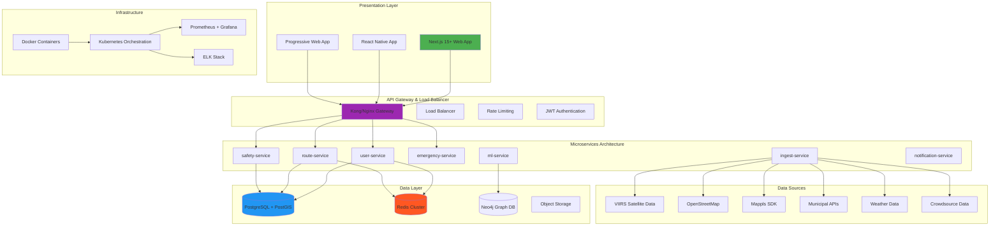
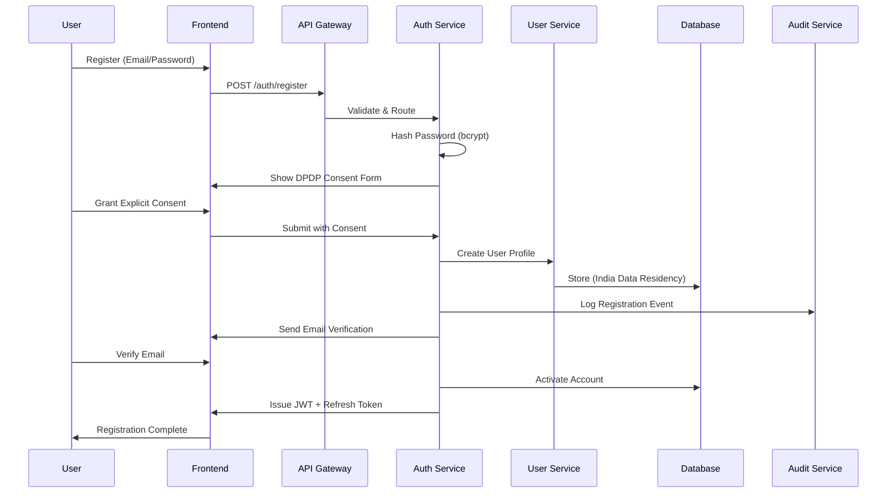
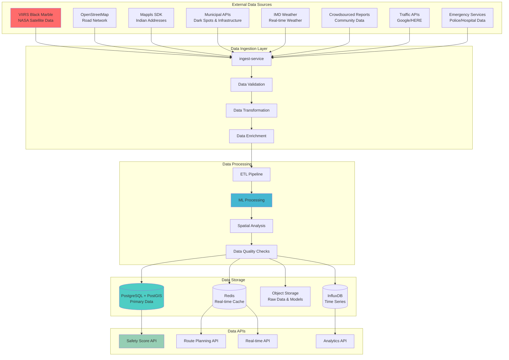
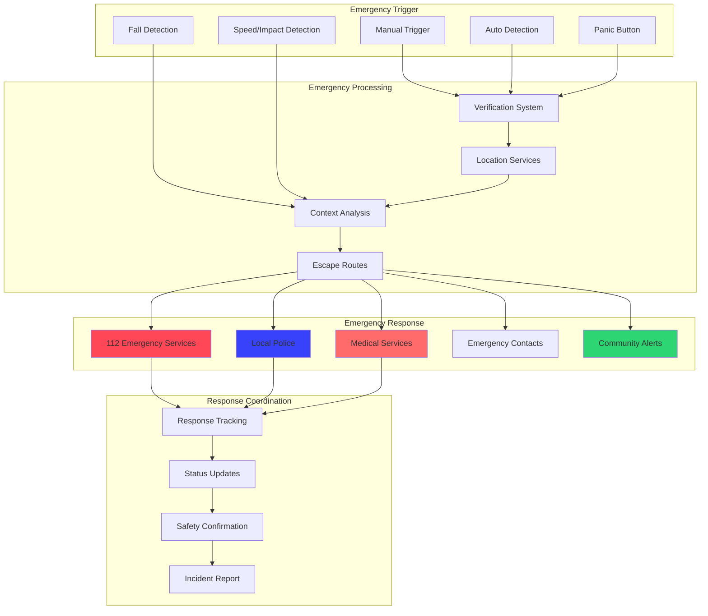
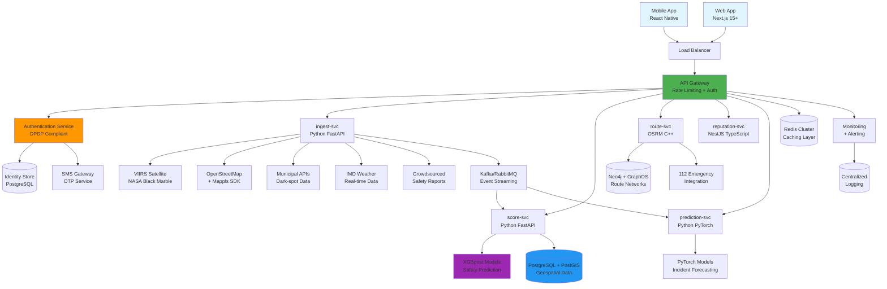
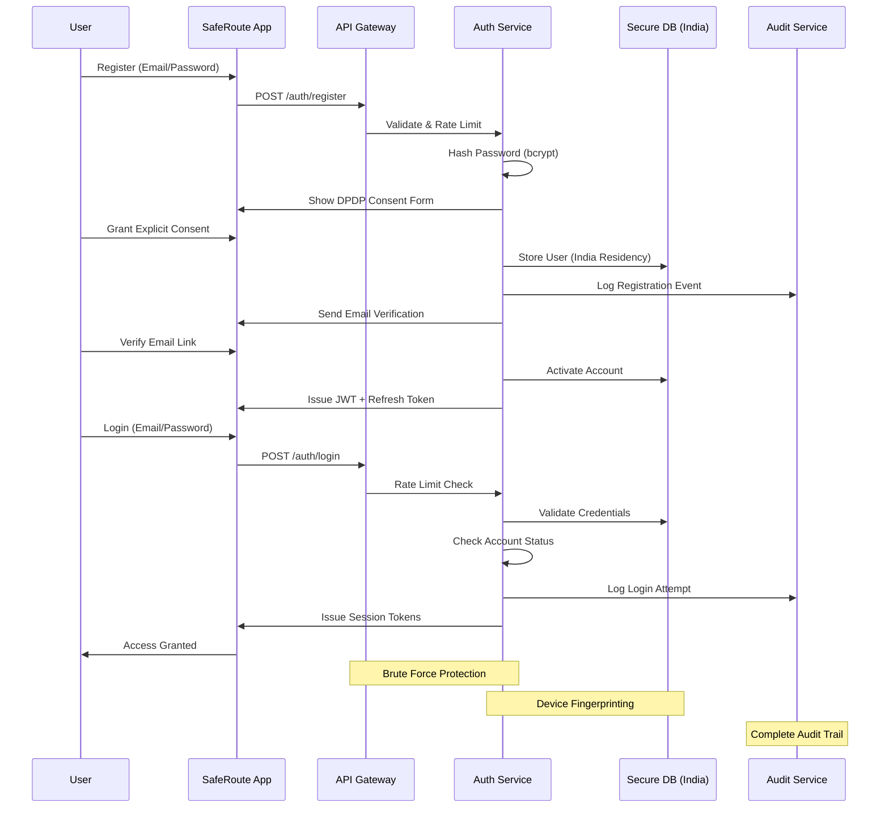
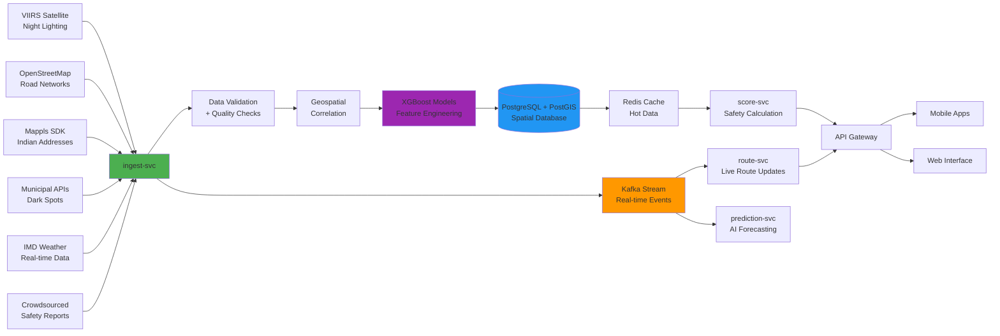

# SafeRoute: Enterprise-Grade AI-Driven Public Safety Navigation System - Implementation Design

## Overview

**Project Mission**: Building AI Runways for Safer Urban Mobility in India through an enterprise-grade, scalable, and modular SafeRoute application that prioritizes safety over speed for pedestrians and two-wheeler riders.

**Enterprise Context**: This design transforms the existing SafeGuard Navigator prototype into a production-ready SafeRoute system implementing the complete vision outlined in the Infosys PALS TechZooka Hackathon 2025 solution document, with enterprise-grade architecture, scalability, and robustness.

**Key Statistics Driving the Solution**:
- Road Accidents (2022): 4,61,312 resulting in 1,68,491 deaths
- Vulnerable Road Users: 65% of fatalities (45% two-wheelers, 20% pedestrians)
- Night-time Fatalities in Delhi: 43% pedestrian deaths and 38% two-wheeler deaths
- Infrastructure Gaps: 4,289 "dark spots" identified in Delhi

## Technology Stack & Architecture

### Production-Ready Enterprise Stack



### Core Technology Components

#### Frontend Architecture
- **Framework**: Next.js 15+ with App Router, React 19+, TypeScript 5+
- **UI Framework**: Tailwind CSS v4+, Shadcn UI, Magic UI, Framer Motion
- **Maps Integration**: Mappls SDK (primary), MapLibre GL, OpenStreetMap tiles
- **State Management**: Zustand, React Query (TanStack Query)
- **Real-time**: Socket.IO client, Server-Sent Events
- **Internationalization**: next-intl (English/Tamil bilingual support)
- **PWA**: Service Workers, offline capabilities, push notifications

#### Backend Microservices
- **API Gateway**: Kong/Nginx with rate limiting, authentication, request routing
- **Core Services**: Node.js/NestJS, Python/FastAPI for ML services
- **Authentication**: JWT with refresh tokens, OAuth 2.0, RBAC
- **Real-time Processing**: Apache Kafka, RabbitMQ for event streaming
- **Routing Engine**: OSRM (C++), GraphHopper (Java) for performance
- **ML/AI**: XGBoost/LightGBM, PyTorch, TensorFlow for safety scoring

#### Data Architecture
- **Primary Database**: PostgreSQL 15+ with PostGIS for geospatial operations
- **Caching**: Redis Cluster for session management, real-time data
- **Graph Database**: Neo4j for relationship analysis, social features
- **Object Storage**: AWS S3/MinIO for media, documents, ML models
- **Search**: Elasticsearch for full-text search, analytics
- **Time Series**: InfluxDB for IoT data, metrics collection

#### DevOps & Infrastructure
- **Containerization**: Docker with multi-stage builds
- **Orchestration**: Kubernetes with Helm charts
- **CI/CD**: GitHub Actions, Jenkins, ArgoCD for GitOps
- **Monitoring**: Prometheus, Grafana, Jaeger for distributed tracing
- **Logging**: ELK Stack (Elasticsearch, Logstash, Kibana)
- **Security**: Vault for secrets management, OWASP compliance

## Enterprise Authentication & Authorization Architecture

### DPDP Act 2023 Compliant Authentication System



#### Enhanced User Model

```typescript
interface EnterpriseUser {
  // Identity
  id: string;
  email: string;
  phone?: string;
  profile: {
    firstName: string;
    lastName: string;
    displayName: string;
    avatar?: string;
    dateOfBirth?: Date;
    gender?: UserGender;
    language: 'en' | 'ta' | 'hi'; // English, Tamil, Hindi
    timezone: string;
  };

  // Authentication & Security
  auth: {
    passwordHash: string;
    saltRounds: number;
    emailVerified: boolean;
    emailVerifiedAt?: Date;
    twoFactorEnabled: boolean;
    twoFactorSecret?: string;
    backupCodes: string[];
    lastPasswordChange: Date;
    passwordHistory: string[]; // Last 5 password hashes
    loginAttempts: number;
    lockedUntil?: Date;
    sessionTokens: SessionToken[];
  };

  // DPDP Act 2023 Compliance
  privacy: {
    dataProcessingConsent: boolean;
    consentVersion: string;
    consentDate: Date;
    dataRetentionExpiry: Date;
    locationSharingLevel: 'precise' | 'coarse' | 'city_only';
    crowdsourcingParticipation: boolean;
    personalizedRecommendations: boolean;
    analyticsConsent: boolean;
    marketingConsent: boolean;
    thirdPartySharing: boolean;
    rightToPortability: boolean;
    rightToErasure: boolean;
  };

  // SafeRoute Specific
  safetyProfile: {
    userType: 'pedestrian' | 'two_wheeler' | 'cyclist' | 'public_transport';
    riskTolerance: number; // 0-100
    timePreference: 'safety_first' | 'balanced' | 'time_first';
    accessibilityNeeds?: AccessibilityRequirements;
    emergencyContacts: EmergencyContact[];
    medicalInfo?: MedicalInformation;
    preferences: SafetyPreferences;
  };

  // Device & Technical
  devices: {
    id: string;
    type: 'mobile' | 'tablet' | 'desktop';
    os: string;
    version: string;
    hasAccelerometer: boolean;
    hasCamera: boolean;
    hasGPS: boolean;
    offlineCapable: boolean;
    networkQuality: 'high' | 'medium' | 'low';
    lastSeenAt: Date;
    pushTokens: string[];
  }[];

  // Reputation & Community
  reputation: {
    trustLevel: number; // 0-1 Wilson score
    reportsSubmitted: number;
    reportsVerified: number;
    reportsRejected: number;
    communityStanding: 'new' | 'trusted' | 'verified' | 'expert';
    achievements: CommunityAchievement[];
    badges: SafetyBadge[];
    lastCalculatedAt: Date;
  };

  // Subscription & Billing
  subscription: {
    plan: 'free' | 'premium' | 'enterprise';
    status: 'active' | 'cancelled' | 'expired' | 'trial';
    startDate: Date;
    endDate?: Date;
    features: string[];
    paymentMethod?: PaymentMethod;
    billingAddress?: Address;
  };

  // Analytics & Insights
  analytics: {
    totalRoutes: number;
    averageSafetyScore: number;
    emergencyAlerts: number;
    dataContributions: number;
    appUsageHours: number;
    lastActiveAt: Date;
    favoriteRoutes: Route[];
    routeHistory: RouteHistoryEntry[];
  };

  // Audit & Compliance
  audit: {
    createdAt: Date;
    updatedAt: Date;
    lastLoginAt: Date;
    ipAddresses: string[];
    geoLocations: GeoLocation[];
    dataExports: DataExport[];
    consentHistory: ConsentHistoryEntry[];
    deletionRequests: DeletionRequest[];
  };
}
```

#### Role-Based Access Control (RBAC)

```typescript
interface Permission {
  resource: string;
  actions: ('create' | 'read' | 'update' | 'delete' | 'moderate' | 'export')[];
  conditions?: PermissionCondition[];
}

interface Role {
  name: string;
  permissions: Permission[];
  hierarchy: number; // 1-100, higher = more permissions
  description: string;
}

const enterpriseRoles: Role[] = [
  {
    name: 'user',
    hierarchy: 10,
    permissions: [
      { resource: 'routes', actions: ['read', 'create'] },
      { resource: 'safety-reports', actions: ['read', 'create'] },
      { resource: 'emergency-services', actions: ['read', 'create'] },
      { resource: 'profile', actions: ['read', 'update'] }
    ],
    description: 'Standard user with basic navigation features'
  },
  {
    name: 'premium_user',
    hierarchy: 20,
    permissions: [
      { resource: 'routes', actions: ['read', 'create'] },
      { resource: 'safety-reports', actions: ['read', 'create'] },
      { resource: 'emergency-services', actions: ['read', 'create'] },
      { resource: 'analytics', actions: ['read'] },
      { resource: 'offline-maps', actions: ['read', 'create'] },
      { resource: 'real-time-alerts', actions: ['read'] }
    ],
    description: 'Premium user with advanced features'
  },
  {
    name: 'trusted_reporter',
    hierarchy: 30,
    permissions: [
      { resource: 'reports', actions: ['read', 'create', 'moderate'] },
      { resource: 'community-moderation', actions: ['read', 'moderate'] },
      { resource: 'verification', actions: ['read', 'create'] }
    ],
    description: 'High-reputation community contributor'
  },
  {
    name: 'civic_partner',
    hierarchy: 40,
    permissions: [
      { resource: 'municipal-data', actions: ['read', 'create', 'update'] },
      { resource: 'infrastructure-analytics', actions: ['read', 'export'] },
      { resource: 'civic-reports', actions: ['read', 'create', 'update'] },
      { resource: 'public-dashboard', actions: ['read'] }
    ],
    description: 'Municipal/government partner access'
  },
  {
    name: 'admin',
    hierarchy: 90,
    permissions: [
      { resource: '*', actions: ['create', 'read', 'update', 'delete', 'moderate', 'export'] }
    ],
    description: 'Full system administration'
  },
  {
    name: 'super_admin',
    hierarchy: 100,
    permissions: [
      { resource: '*', actions: ['create', 'read', 'update', 'delete', 'moderate', 'export'] },
      { resource: 'system-config', actions: ['create', 'read', 'update', 'delete'] },
      { resource: 'user-management', actions: ['create', 'read', 'update', 'delete'] }
    ],
    description: 'System owner with unrestricted access'
  }
];
```

## SafeRoute Multi-Factor SafetyScore Algorithm Implementation

### Core Algorithm Architecture

```typescript
interface SafetyScoreEngine {
  calculateScore(edge: RouteEdge, context: SafetyContext): SafetyScore;
  updateWeights(userFeedback: UserFeedback[]): void;
  trainModel(trainingData: SafetyTrainingData[]): void;
  predictRisk(location: Coordinates, timeframe: number): RiskPrediction;
}

interface SafetyScore {
  overall: number; // 0-100 final safety score
  confidence: number; // 0-1 data reliability
  
  factors: {
    lighting: LightingFactor;
    footfall: FootfallFactor;
    hazards: HazardFactor;
    proximity: ProximityFactor;
  };
  
  contextual: {
    timeOfDay: 'morning' | 'afternoon' | 'evening' | 'night';
    weather: WeatherCondition;
    userType: UserType;
    localEvents: LocalEvent[];
    seasonalAdjustments: number;
  };
  
  aiPredictions: {
    riskForecast: RiskPrediction[];
    anomalyDetection: AnomalyAlert[];
    incidentProbability: number;
    recommendedActions: string[];
  };
  
  dataSources: DataSourceAttribution[];
  lastUpdated: Date;
  expiresAt: Date;
}

// Core SafetyScore Formula: SafetyScore(e) = wL * L(e) + wF * F(e) + wH * H(e) + wP * P(e)
class EnterpriseSeaftyScoreEngine implements SafetyScoreEngine {
  private weights = {
    lighting: 0.30,      // wL - Critical for night safety
    footfall: 0.25,      // wF - Activity indicates safety
    hazards: 0.20,       // wH - Incident reports (inverted)
    proximity: 0.25      // wP - Help availability
  };

  private mlModels: {
    riskPredictor: XGBoostModel;
    anomalyDetector: IsolationForestModel;
    seasonalAdjuster: TimeSeriesModel;
    weatherImpact: RegressionModel;
  };

  calculateScore(edge: RouteEdge, context: SafetyContext): SafetyScore {
    // L(e) - Lighting Quality Score
    const lightingScore = this.calculateLightingScore(edge, context);
    
    // F(e) - Footfall & Activity Score  
    const footfallScore = this.calculateFootfallScore(edge, context);
    
    // H(e) - Hazard Index (inverted - lower hazards = higher safety)
    const hazardScore = this.calculateHazardScore(edge, context);
    
    // P(e) - Proximity to Help Score
    const proximityScore = this.calculateProximityScore(edge, context);
    
    // Base calculation
    const baseScore = 
      this.weights.lighting * lightingScore +
      this.weights.footfall * footfallScore +
      this.weights.hazards * (100 - hazardScore) + // Inverted
      this.weights.proximity * proximityScore;
    
    // Apply contextual adjustments
    const contextualScore = this.applyContextualAdjustments(baseScore, context);
    
    // AI-driven predictions and adjustments
    const aiAdjustments = this.getAIPredictions(edge, context);
    
    // Final score with confidence calculation
    const finalScore = Math.max(0, Math.min(100, 
      contextualScore + aiAdjustments.scoreAdjustment
    ));
    
    return {
      overall: Math.round(finalScore),
      confidence: this.calculateConfidence(edge, context),
      factors: {
        lighting: this.getLightingFactorDetails(edge, context),
        footfall: this.getFootfallFactorDetails(edge, context),
        hazards: this.getHazardFactorDetails(edge, context),
        proximity: this.getProximityFactorDetails(edge, context)
      },
      contextual: this.getContextualFactors(context),
      aiPredictions: aiAdjustments,
      dataSources: this.getDataSourceAttribution(edge),
      lastUpdated: new Date(),
      expiresAt: new Date(Date.now() + this.getTTL(context))
    };
  }

  private calculateLightingScore(edge: RouteEdge, context: SafetyContext): number {
    const viirsBrightness = this.getVIIRSData(edge.coordinates);
    const municipalStatus = this.getMunicipalLightingData(edge.coordinates);
    const crowdsourcedReports = this.getCrowdsourcedLightingReports(edge.coordinates);
    const timeAdjustment = this.getTimeBasedLightingAdjustment(context.timeOfDay);
    
    // Weighted combination of data sources
    let score = 0;
    let totalWeight = 0;
    
    if (viirsBrightness !== null) {
      score += viirsBrightness * 0.4; // VIIRS weight: 40%
      totalWeight += 0.4;
    }
    
    if (municipalStatus !== null) {
      score += municipalStatus * 0.3; // Municipal weight: 30%
      totalWeight += 0.3;
    }
    
    if (crowdsourcedReports.length > 0) {
      const crowdScore = this.aggregateCrowdsourcedLighting(crowdsourcedReports);
      score += crowdScore * 0.3; // Crowdsourced weight: 30%
      totalWeight += 0.3;
    }
    
    const normalizedScore = totalWeight > 0 ? score / totalWeight : 50;
    return normalizedScore * timeAdjustment;
  }

  private calculateFootfallScore(edge: RouteEdge, context: SafetyContext): number {
    const poiDensity = this.getPOIDensity(edge.coordinates, 500); // 500m radius
    const businessActivity = this.getBusinessActivity(edge.coordinates, context.timeOfDay);
    const transitActivity = this.getTransitActivity(edge.coordinates);
    const historicalFootfall = this.getHistoricalFootfallData(edge.coordinates, context.timeOfDay);
    
    // Combine factors with appropriate weights
    return (
      poiDensity * 0.3 +
      businessActivity * 0.4 +
      transitActivity * 0.2 +
      historicalFootfall * 0.1
    );
  }

  private calculateHazardScore(edge: RouteEdge, context: SafetyContext): number {
    const recentIncidents = this.getRecentIncidents(edge.coordinates, 30); // 30 days
    const infrastructureIssues = this.getInfrastructureIssues(edge.coordinates);
    const weatherHazards = this.getWeatherHazards(edge.coordinates, context.weather);
    const crowdsourcedHazards = this.getCrowdsourcedHazards(edge.coordinates);
    
    // Apply temporal decay to recent incidents
    let hazardScore = 0;
    
    recentIncidents.forEach(incident => {
      const daysAgo = (Date.now() - incident.timestamp.getTime()) / (1000 * 60 * 60 * 24);
      const decayFactor = Math.exp(-daysAgo / 10); // Exponential decay over 10 days
      const severity = incident.severity / 5; // Normalize to 0-1
      hazardScore += severity * decayFactor * 20; // Scale to 0-20 per incident
    });
    
    infrastructureIssues.forEach(issue => {
      hazardScore += issue.severity * 5; // Scale to 0-25
    });
    
    if (weatherHazards.length > 0) {
      hazardScore += weatherHazards.reduce((sum, hazard) => sum + hazard.severity, 0) * 5;
    }
    
    crowdsourcedHazards.forEach(hazard => {
      const trustWeight = hazard.reporterTrustLevel;
      hazardScore += hazard.severity * trustWeight * 10;
    });
    
    return Math.min(100, hazardScore); // Cap at 100
  }

  private calculateProximityScore(edge: RouteEdge, context: SafetyContext): number {
    const emergencyServices = this.getNearbyEmergencyServices(edge.coordinates);
    const policeStations = this.getNearbyPoliceStations(edge.coordinates);
    const hospitals = this.getNearbyHospitals(edge.coordinates);
    const safePublicSpaces = this.getNearbySeafePublicSpaces(edge.coordinates);
    const cctvCoverage = this.getCCTVCoverage(edge.coordinates);
    
    let proximityScore = 0;
    
    // Police stations (weight: 30%)
    if (policeStations.length > 0) {
      const nearestPolice = Math.min(...policeStations.map(p => p.distance));
      proximityScore += (1000 - Math.min(1000, nearestPolice)) / 1000 * 30;
    }
    
    // Hospitals (weight: 25%)
    if (hospitals.length > 0) {
      const nearestHospital = Math.min(...hospitals.map(h => h.distance));
      proximityScore += (2000 - Math.min(2000, nearestHospital)) / 2000 * 25;
    }
    
    // Emergency services (weight: 20%)
    if (emergencyServices.length > 0) {
      const nearestEmergency = Math.min(...emergencyServices.map(e => e.distance));
      proximityScore += (1500 - Math.min(1500, nearestEmergency)) / 1500 * 20;
    }
    
    // Safe public spaces (weight: 15%)
    if (safePublicSpaces.length > 0) {
      const nearestSafe = Math.min(...safePublicSpaces.map(s => s.distance));
      proximityScore += (500 - Math.min(500, nearestSafe)) / 500 * 15;
    }
    
    // CCTV coverage (weight: 10%)
    proximityScore += cctvCoverage * 10;
    
    return proximityScore;
  }
}
```

## Real-World Data Integration Pipeline

### Multi-Source Data Architecture



### Data Source Implementation

```typescript
interface DataSourceManager {
  sources: DataSource[];
  processors: DataProcessor[];
  validators: DataValidator[];
  storage: DataStorageManager;
}

interface DataSource {
  id: string;
  provider: string;
  type: 'satellite' | 'municipal' | 'crowdsourced' | 'commercial' | 'government';
  endpoint: string;
  authentication: AuthConfig;
  updateFrequency: 'realtime' | 'hourly' | 'daily' | 'weekly';
  reliability: number; // 0-1
  coverage: 'global' | 'national' | 'regional' | 'local';
  dataTypes: string[];
  rateLimits: RateLimit;
  lastSync: Date;
  status: 'active' | 'inactive' | 'error' | 'maintenance';
}

class EnterpriseDataIngestionService {
  private dataSources: Map<string, DataSource> = new Map();
  private processors: Map<string, DataProcessor> = new Map();
  private kafka: KafkaProducer;
  private redis: RedisClient;
  private postgres: PostgreSQLClient;

  async initializeDataSources(): Promise<void> {
    // VIIRS NASA Satellite Data
    this.registerDataSource({
      id: 'viirs-black-marble',
      provider: 'NASA',
      type: 'satellite',
      endpoint: 'https://worldview.earthdata.nasa.gov/api/v1',
      authentication: { type: 'api_key', key: process.env.NASA_API_KEY },
      updateFrequency: 'daily',
      reliability: 0.95,
      coverage: 'global',
      dataTypes: ['night_lighting', 'brightness_temperature', 'light_pollution'],
      rateLimits: { requests: 1000, window: 3600 },
      lastSync: new Date(),
      status: 'active'
    });

    // OpenStreetMap
    this.registerDataSource({
      id: 'openstreetmap',
      provider: 'OpenStreetMap Foundation',
      type: 'crowdsourced',
      endpoint: 'https://api.openstreetmap.org/api/0.6',
      authentication: { type: 'none' },
      updateFrequency: 'realtime',
      reliability: 0.85,
      coverage: 'global',
      dataTypes: ['roads', 'buildings', 'amenities', 'land_use'],
      rateLimits: { requests: 10000, window: 3600 },
      lastSync: new Date(),
      status: 'active'
    });

    // Mappls SDK for Indian Context
    this.registerDataSource({
      id: 'mappls-sdk',
      provider: 'Mappls',
      type: 'commercial',
      endpoint: 'https://apis.mappls.com/advancedmaps/v1',
      authentication: { type: 'api_key', key: process.env.MAPPLS_API_KEY },
      updateFrequency: 'realtime',
      reliability: 0.90,
      coverage: 'national',
      dataTypes: ['addresses', 'local_business', 'navigation', 'poi'],
      rateLimits: { requests: 50000, window: 86400 },
      lastSync: new Date(),
      status: 'active'
    });

    // India Meteorological Department
    this.registerDataSource({
      id: 'imd-weather',
      provider: 'India Meteorological Department',
      type: 'government',
      endpoint: 'https://mausam.imd.gov.in/backend/api',
      authentication: { type: 'api_key', key: process.env.IMD_API_KEY },
      updateFrequency: 'hourly',
      reliability: 0.85,
      coverage: 'national',
      dataTypes: ['weather', 'visibility', 'rainfall', 'alerts'],
      rateLimits: { requests: 1000, window: 3600 },
      lastSync: new Date(),
      status: 'active'
    });

    // Municipal Data Sources (Delhi as example)
    this.registerDataSource({
      id: 'delhi-municipal',
      provider: 'Delhi Government',
      type: 'municipal',
      endpoint: 'https://data.delhi.gov.in/api',
      authentication: { type: 'api_key', key: process.env.DELHI_API_KEY },
      updateFrequency: 'weekly',
      reliability: 0.80,
      coverage: 'local',
      dataTypes: ['dark_spots', 'street_lights', 'cctv', 'police_stations'],
      rateLimits: { requests: 500, window: 3600 },
      lastSync: new Date(),
      status: 'active'
    });
  }

  async ingestData(sourceId: string, dataType: string): Promise<void> {
    const source = this.dataSources.get(sourceId);
    if (!source) throw new Error(`Data source ${sourceId} not found`);

    try {
      // Check rate limits
      await this.checkRateLimit(source);

      // Fetch data from source
      const rawData = await this.fetchFromSource(source, dataType);

      // Validate data quality
      const validation = await this.validateData(rawData, source, dataType);
      if (!validation.isValid) {
        throw new Error(`Data validation failed: ${validation.errors.join(', ')}`);
      }

      // Transform and enrich data
      const transformedData = await this.transformData(rawData, source, dataType);
      const enrichedData = await this.enrichData(transformedData, source);

      // Publish to Kafka for real-time processing
      await this.kafka.produce('data-ingestion', {
        sourceId,
        dataType,
        data: enrichedData,
        timestamp: new Date(),
        metadata: {
          reliability: source.reliability,
          coverage: source.coverage,
          version: '1.0'
        }
      });

      // Store in appropriate storage
      await this.storeData(enrichedData, source, dataType);

      // Update source status
      source.lastSync = new Date();
      source.status = 'active';

    } catch (error) {
      console.error(`Data ingestion failed for ${sourceId}:`, error);
      source.status = 'error';
      
      // Send alert to monitoring system
      await this.sendAlert({
        level: 'error',
        source: sourceId,
        message: `Data ingestion failed: ${error.message}`,
        timestamp: new Date()
      });
    }
  }

  private async processVIIRSData(data: any): Promise<LightingData[]> {
    // Process NASA VIIRS Black Marble satellite data
    return data.features.map((feature: any) => ({
      coordinates: feature.geometry.coordinates,
      brightness: feature.properties.radiance,
      confidence: feature.properties.confidence,
      timestamp: new Date(feature.properties.acq_date),
      satellite: 'VIIRS',
      processingLevel: 'L3'
    }));
  }

  private async processMunicipalData(data: any, city: string): Promise<MunicipalData[]> {
    // Process municipal dark spot and infrastructure data
    return data.records.map((record: any) => ({
      location: {
        coordinates: [record.longitude, record.latitude],
        address: record.location_description,
        ward: record.ward_number
      },
      infrastructure: {
        streetLights: record.street_lights_status,
        cctv: record.cctv_coverage,
        policeStation: record.nearest_police_station
      },
      darkSpot: {
        identified: record.is_dark_spot,
        reportedDate: new Date(record.reported_date),
        status: record.resolution_status,
        priority: record.priority_level
      },
      city,
      lastUpdated: new Date(record.last_updated)
    }));
  }

  private async processCrowdsourcedData(data: any): Promise<CrowdsourcedReport[]> {
    // Process community-submitted safety reports
    return data.map((report: any) => ({
      id: report.id,
      type: report.report_type,
      location: report.coordinates,
      description: report.description,
      severity: report.severity_level,
      reporter: {
        id: report.user_id,
        trustLevel: report.user_trust_score,
        isVerified: report.user_verified
      },
      verification: {
        status: report.verification_status,
        votes: report.verification_votes,
        moderatorReview: report.moderator_reviewed
      },
      timestamp: new Date(report.created_at),
      expiresAt: new Date(report.expires_at)
    }));
  }
}
```

## Emergency Response & 112 Integration

### Comprehensive Emergency System



### Emergency Alert Implementation

```typescript
interface EmergencyAlert {
  id: string;
  user: UserProfile;
  trigger: {
    type: 'manual' | 'panic' | 'fall_detection' | 'impact' | 'prolonged_inactivity';
    source: 'app' | 'device' | 'ai_detection';
    timestamp: Date;
    confidence: number;
    metadata: TriggerMetadata;
  };
  
  location: {
    coordinates: Coordinates;
    accuracy: number;
    address: string;
    landmark: string;
    area: AreaInfo;
    safetyScore: number;
    escapeRoutes: Route[];
  };
  
  emergency: {
    type: 'medical' | 'crime' | 'accident' | 'natural_disaster' | 'personal_safety';
    severity: 1 | 2 | 3 | 4 | 5;
    category: 'life_threatening' | 'injury' | 'crime_in_progress' | 'harassment' | 'infrastructure';
    description?: string;
    media?: MediaAttachment[];
  };
  
  response: {
    emergency112: {
      contacted: boolean;
      requestId?: string;
      dispatchTime?: Date;
      eta?: number;
      status: 'dispatched' | 'en_route' | 'arrived' | 'completed';
      responderInfo?: ResponderInfo;
    };
    
    localServices: {
      police: ServiceResponse;
      medical: ServiceResponse;
      fire?: ServiceResponse;
      womenHelpline?: ServiceResponse;
    };
    
    emergencyContacts: {
      notified: EmergencyContact[];
      pending: EmergencyContact[];
      failed: EmergencyContact[];
      responses: ContactResponse[];
    };
    
    community: {
      alertSent: boolean;
      volunteersNotified: number;
      nearbyUsersAlerted: number;
      communityResponse: CommunityResponseInfo[];
    };
  };
  
  timeline: EmergencyEvent[];
  status: 'active' | 'responding' | 'safe' | 'resolved' | 'false_alarm';
  resolution: {
    outcome: string;
    safetyConfirmed: boolean;
    helpArrived: boolean;
    incidentReport?: IncidentReport;
    feedback?: EmergencyFeedback;
  };
}

class EnterpriseEmergencyService {
  private emergency112Client: Emergency112Client;
  private locationService: LocationService;
  private notificationService: NotificationService;
  private routeService: RouteService;
  private redis: RedisClient;
  private websocket: WebSocketManager;

  async triggerEmergency(
    userId: string,
    triggerType: EmergencyTriggerType,
    location?: Coordinates,
    context?: EmergencyContext
  ): Promise<EmergencyAlert> {
    const startTime = Date.now();
    const user = await this.getUserProfile(userId);
    
    // Get accurate location (sub-3-second requirement)
    const emergencyLocation = location || await this.locationService.getEmergencyLocation(userId);
    
    // Create emergency alert
    const alert: EmergencyAlert = {
      id: generateEmergencyId(),
      user,
      trigger: {
        type: triggerType,
        source: 'app',
        timestamp: new Date(),
        confidence: this.calculateTriggerConfidence(triggerType, context),
        metadata: context
      },
      location: {
        coordinates: emergencyLocation,
        accuracy: await this.locationService.getAccuracy(userId),
        address: await this.locationService.reverseGeocode(emergencyLocation),
        landmark: await this.locationService.getNearestLandmark(emergencyLocation),
        area: await this.locationService.getAreaInfo(emergencyLocation),
        safetyScore: await this.safetyService.getScore(emergencyLocation),
        escapeRoutes: await this.calculateEmergencyRoutes(emergencyLocation)
      },
      emergency: this.classifyEmergency(triggerType, context),
      response: {
        emergency112: { contacted: false, status: 'dispatched' },
        localServices: { police: {}, medical: {}, fire: {} },
        emergencyContacts: { notified: [], pending: [], failed: [], responses: [] },
        community: { alertSent: false, volunteersNotified: 0, nearbyUsersAlerted: 0, communityResponse: [] }
      },
      timeline: [{ event: 'emergency_triggered', timestamp: new Date(), data: triggerType }],
      status: 'active',
      resolution: {}
    };

    // Store emergency alert
    await this.storeEmergencyAlert(alert);

    // Parallel emergency response (for speed)
    const responses = await Promise.allSettled([
      this.contact112Services(alert),
      this.notifyEmergencyContacts(alert),
      this.alertCommunity(alert),
      this.notifyLocalServices(alert),
      this.sendRealtimeUpdates(alert)
    ]);

    // Update alert with response information
    alert.response = this.aggregateResponses(responses);
    await this.updateEmergencyAlert(alert);

    // Ensure sub-3-second response time
    const responseTime = Date.now() - startTime;
    if (responseTime > 3000) {
      console.warn(`Emergency response took ${responseTime}ms - exceeds 3-second target`);
    }

    return alert;
  }

  private async contact112Services(alert: EmergencyAlert): Promise<void> {
    try {
      // India's unified emergency number integration
      const emergency112Response = await this.emergency112Client.createRequest({
        location: alert.location.coordinates,
        emergencyType: alert.emergency.type,
        severity: alert.emergency.severity,
        userInfo: {
          id: alert.user.id,
          name: `${alert.user.profile.firstName} ${alert.user.profile.lastName}`,
          phone: alert.user.phone,
          emergencyContacts: alert.user.safetyProfile.emergencyContacts
        },
        additionalInfo: {
          safetyScore: alert.location.safetyScore,
          nearestLandmark: alert.location.landmark,
          escapeRoutes: alert.location.escapeRoutes.map(r => r.description)
        }
      });

      alert.response.emergency112 = {
        contacted: true,
        requestId: emergency112Response.requestId,
        dispatchTime: emergency112Response.dispatchTime,
        eta: emergency112Response.eta,
        status: emergency112Response.status,
        responderInfo: emergency112Response.responderInfo
      };

      // Track 112 response in real-time
      this.track112Response(alert.id, emergency112Response.requestId);

    } catch (error) {
      console.error('Failed to contact 112 services:', error);
      
      // Fallback to direct local service contact
      await this.contactLocalServicesDirectly(alert);
    }
  }

  private async notifyEmergencyContacts(alert: EmergencyAlert): Promise<void> {
    const contacts = alert.user.safetyProfile.emergencyContacts
      .sort((a, b) => a.priority - b.priority);

    const notifications = contacts.map(async (contact) => {
      try {
        // Multi-channel notification (SMS, Call, WhatsApp, Email)
        const notificationResult = await this.notificationService.sendEmergencyAlert({
          contact,
          alert,
          channels: ['sms', 'call', 'whatsapp', 'email'],
          urgency: 'critical',
          includeLocation: true,
          includeEscapeRoutes: true
        });

        return {
          contact,
          status: 'sent',
          channels: notificationResult.successfulChannels,
          timestamp: new Date()
        };
      } catch (error) {
        return {
          contact,
          status: 'failed',
          error: error.message,
          timestamp: new Date()
        };
      }
    });

    const results = await Promise.allSettled(notifications);
    
    alert.response.emergencyContacts.notified = results
      .filter(r => r.status === 'fulfilled' && r.value.status === 'sent')
      .map(r => (r as PromiseFulfilledResult<any>).value);
      
    alert.response.emergencyContacts.failed = results
      .filter(r => r.status === 'fulfilled' && r.value.status === 'failed')
      .map(r => (r as PromiseFulfilledResult<any>).value);
  }

  private async alertCommunity(alert: EmergencyAlert): Promise<void> {
    if (!alert.user.privacy.crowdsourcingParticipation) {
      return; // User opted out of community features
    }

    // Find nearby SafeRoute users
    const nearbyUsers = await this.findNearbyUsers(alert.location.coordinates, 2000); // 2km radius
    
    // Filter users who can help
    const potentialHelpers = nearbyUsers.filter(user => 
      user.safetyProfile.emergencyResponse?.willingToHelp &&
      user.reputation.communityStanding !== 'new'
    );

    // Send community alert
    const communityAlert = {
      type: 'emergency_nearby',
      severity: alert.emergency.severity,
      location: {
        coordinates: alert.location.coordinates,
        area: alert.location.area.name,
        landmark: alert.location.landmark
      },
      helpNeeded: this.determineHelpNeeded(alert.emergency.type),
      safetyInfo: {
        currentScore: alert.location.safetyScore,
        escapeRoutes: alert.location.escapeRoutes
      }
    };

    const communityNotifications = potentialHelpers.map(user => 
      this.notificationService.sendCommunityAlert(user.id, communityAlert)
    );

    await Promise.allSettled(communityNotifications);

    alert.response.community = {
      alertSent: true,
      volunteersNotified: potentialHelpers.length,
      nearbyUsersAlerted: nearbyUsers.length,
      communityResponse: []
    };
  }

  private async calculateEmergencyRoutes(location: Coordinates): Promise<Route[]> {
    // Calculate multiple escape routes to safe locations
    const safeDestinations = await this.findSafeDestinations(location, 1000); // 1km radius
    
    const routePromises = safeDestinations.map(async (destination) => {
      return await this.routeService.calculateRoute({
        start: location,
        end: destination.coordinates,
        optimization: 'safety_first',
        urgency: 'emergency',
        avoidanceFactors: {
          darkAreas: true,
          isolatedStreets: true,
          constructionZones: true,
          knownHazards: true
        }
      });
    });

    const routes = await Promise.allSettled(routePromises);
    
    return routes
      .filter(r => r.status === 'fulfilled')
      .map(r => (r as PromiseFulfilledResult<Route>).value)
      .sort((a, b) => b.safetyScore - a.safetyScore) // Sort by safety score descending
      .slice(0, 3); // Return top 3 safest routes
  }
}
```

## Enterprise Microservices Architecture

### Core Service Implementation

```typescript
interface MicroserviceConfig {
  name: string;
  version: string;
  port: number;
  health: {
    endpoint: string;
    timeout: number;
    interval: number;
  };
  dependencies: ServiceDependency[];
  resources: ResourceConfig;
  scaling: ScalingConfig;
}

// User Service - Authentication & Profile Management
class UserService implements EnterpriseService {
  private config: MicroserviceConfig = {
    name: 'user-service',
    version: '1.0.0',
    port: 3001,
    health: { endpoint: '/health', timeout: 5000, interval: 30000 },
    dependencies: [
      { name: 'postgres', type: 'database', critical: true },
      { name: 'redis', type: 'cache', critical: false },
      { name: 'notification-service', type: 'service', critical: false }
    ],
    resources: { cpu: '500m', memory: '512Mi', storage: '10Gi' },
    scaling: { min: 2, max: 10, targetCPU: 70 }
  };

  async register(userData: UserRegistrationData): Promise<UserResponse> {
    // DPDP Act 2023 compliant registration
    const validation = await this.validateRegistrationData(userData);
    if (!validation.isValid) {
      throw new ValidationError(validation.errors);
    }

    // Check consent requirements
    if (!userData.privacy.dataProcessingConsent) {
      throw new ConsentError('Data processing consent required');
    }

    // Hash password with bcrypt
    const saltRounds = 12;
    const passwordHash = await bcrypt.hash(userData.password, saltRounds);

    const user = await this.userRepository.create({
      ...userData,
      password: passwordHash,
      auth: {
        passwordHash,
        saltRounds,
        emailVerified: false,
        twoFactorEnabled: false,
        loginAttempts: 0
      },
      privacy: {
        ...userData.privacy,
        consentDate: new Date(),
        dataRetentionExpiry: new Date(Date.now() + 365 * 24 * 60 * 60 * 1000) // 1 year
      },
      audit: {
        createdAt: new Date(),
        lastLoginAt: null,
        ipAddresses: [userData.ipAddress],
        geoLocations: [userData.location]
      }
    });

    // Send verification email
    await this.notificationService.sendEmailVerification(user.email, user.id);

    // Audit log
    await this.auditService.log({
      userId: user.id,
      action: 'user_registered',
      resource: 'user',
      metadata: { email: user.email, consentVersion: userData.privacy.consentVersion }
    });

    return this.transformUserResponse(user);
  }

  async authenticate(credentials: LoginCredentials): Promise<AuthResponse> {
    const user = await this.userRepository.findByEmail(credentials.email);
    if (!user) {
      throw new AuthenticationError('Invalid credentials');
    }

    // Check account status
    if (user.auth.lockedUntil && user.auth.lockedUntil > new Date()) {
      throw new AccountLockedError('Account temporarily locked');
    }

    // Verify password
    const isValidPassword = await bcrypt.compare(credentials.password, user.auth.passwordHash);
    if (!isValidPassword) {
      await this.handleFailedLogin(user);
      throw new AuthenticationError('Invalid credentials');
    }

    // Check email verification
    if (!user.auth.emailVerified) {
      throw new EmailNotVerifiedError('Email verification required');
    }

    // Reset login attempts
    await this.userRepository.update(user.id, {
      'auth.loginAttempts': 0,
      'auth.lockedUntil': null,
      'auth.lastLoginAt': new Date()
    });

    // Generate JWT tokens
    const accessToken = this.jwtService.generateAccessToken(user);
    const refreshToken = this.jwtService.generateRefreshToken(user);

    // Store refresh token
    await this.tokenRepository.store(refreshToken, user.id);

    // Audit log
    await this.auditService.log({
      userId: user.id,
      action: 'user_login',
      resource: 'auth',
      ipAddress: credentials.ipAddress,
      userAgent: credentials.userAgent
    });

    return {
      user: this.transformUserResponse(user),
      tokens: { accessToken, refreshToken },
      expiresIn: this.jwtService.getAccessTokenExpiry()
    };
  }
}

// Safety Service - Core Safety Scoring Engine
class SafetyService implements EnterpriseService {
  private config: MicroserviceConfig = {
    name: 'safety-service',
    version: '1.0.0',
    port: 3002,
    health: { endpoint: '/health', timeout: 5000, interval: 30000 },
    dependencies: [
      { name: 'postgres', type: 'database', critical: true },
      { name: 'redis', type: 'cache', critical: true },
      { name: 'ml-service', type: 'service', critical: true },
      { name: 'ingest-service', type: 'service', critical: false }
    ],
    resources: { cpu: '1000m', memory: '1Gi', storage: '20Gi' },
    scaling: { min: 3, max: 20, targetCPU: 80 }
  };

  private safetyEngine: EnterpriseSeaftyScoreEngine;
  private cache: RedisClient;
  private mlService: MLServiceClient;

  async calculateSafetyScore(request: SafetyScoreRequest): Promise<SafetyScore> {
    const cacheKey = this.generateCacheKey(request);
    
    // Check cache first
    const cached = await this.cache.get(cacheKey);
    if (cached && !this.isExpired(cached)) {
      return JSON.parse(cached);
    }

    // Calculate new safety score
    const context = await this.buildSafetyContext(request);
    const edge = await this.getRouteEdge(request.coordinates);
    
    const safetyScore = await this.safetyEngine.calculateScore(edge, context);
    
    // Cache result with TTL based on data freshness
    const ttl = this.calculateTTL(safetyScore);
    await this.cache.setex(cacheKey, ttl, JSON.stringify(safetyScore));

    // Store in database for analytics
    await this.safetyRepository.store(safetyScore);

    return safetyScore;
  }

  async generateSafetyHeatmap(bounds: GeoBounds, zoom: number): Promise<HeatmapData> {
    const grid = this.generateGrid(bounds, zoom);
    
    const safetyPromises = grid.cells.map(async (cell) => {
      const score = await this.calculateSafetyScore({
        coordinates: cell.center,
        timeOfDay: 'current',
        userType: 'pedestrian'
      });
      
      return {
        coordinates: cell.center,
        score: score.overall,
        confidence: score.confidence
      };
    });

    const safetyData = await Promise.all(safetyPromises);
    
    return {
      bounds,
      zoom,
      data: safetyData,
      generatedAt: new Date(),
      expiresAt: new Date(Date.now() + 3600000) // 1 hour TTL
    };
  }
}

// Route Service - Safety-First Navigation
class RouteService implements EnterpriseService {
  private config: MicroserviceConfig = {
    name: 'route-service',
    version: '1.0.0',
    port: 3003,
    health: { endpoint: '/health', timeout: 5000, interval: 30000 },
    dependencies: [
      { name: 'postgres', type: 'database', critical: true },
      { name: 'osrm', type: 'routing', critical: true },
      { name: 'safety-service', type: 'service', critical: true }
    ],
    resources: { cpu: '2000m', memory: '2Gi', storage: '50Gi' },
    scaling: { min: 5, max: 30, targetCPU: 75 }
  };

  private osrmClient: OSRMClient;
  private safetyService: SafetyServiceClient;
  private routeOptimizer: RouteOptimizer;

  async calculateRoute(request: RouteRequest): Promise<RouteResponse> {
    // Validate request
    const validation = await this.validateRouteRequest(request);
    if (!validation.isValid) {
      throw new ValidationError(validation.errors);
    }

    // Get multiple route options from OSRM
    const routeOptions = await this.osrmClient.route({
      coordinates: [request.start, request.end],
      alternatives: 5,
      steps: true,
      annotations: ['duration', 'distance', 'speed']
    });

    // Calculate safety scores for each route
    const routesWithSafety = await Promise.all(
      routeOptions.routes.map(async (route) => {
        const safetyAnalysis = await this.analyzeeRouteSafety(route, request.context);
        const optimizedRoute = await this.routeOptimizer.optimize(route, request.preferences);
        
        return {
          ...optimizedRoute,
          safetyScore: safetyAnalysis.overallScore,
          safetyFactors: safetyAnalysis.factors,
          recommendations: safetyAnalysis.recommendations,
          hazardAlerts: safetyAnalysis.hazards
        };
      })
    );

    // Sort routes based on user preferences
    const sortedRoutes = this.sortRoutesByPreference(routesWithSafety, request.preferences);

    return {
      routes: sortedRoutes,
      safetyAnalysis: await this.generateSafetyAnalysis(sortedRoutes),
      alternatives: {
        safest: sortedRoutes.reduce((prev, curr) => 
          prev.safetyScore > curr.safetyScore ? prev : curr
        ),
        fastest: sortedRoutes.reduce((prev, curr) => 
          prev.duration < curr.duration ? prev : curr
        ),
        mostDirect: sortedRoutes.reduce((prev, curr) => 
          prev.distance < curr.distance ? prev : curr
        )
      },
      metadata: {
        calculatedAt: new Date(),
        requestId: generateRequestId(),
        version: '1.0.0'
      }
    };
  }

  private async analyzeeRouteSafety(route: Route, context: RouteContext): Promise<RouteSafetyAnalysis> {
    const segments = this.segmentRoute(route, 100); // 100m segments
    
    const segmentAnalyses = await Promise.all(
      segments.map(segment => 
        this.safetyService.calculateSafetyScore({
          coordinates: segment.midpoint,
          timeOfDay: context.timeOfDay,
          userType: context.userType,
          weather: context.weather
        })
      )
    );

    const overallScore = this.calculateWeightedAverage(
      segmentAnalyses.map(analysis => ({
        score: analysis.overall,
        weight: analysis.confidence
      }))
    );

    return {
      overallScore,
      segments: segmentAnalyses,
      factors: this.aggregateFactors(segmentAnalyses),
      hazards: this.identifyRouteHazards(segmentAnalyses),
      recommendations: this.generateRouteRecommendations(segmentAnalyses, context)
    };
  }
}
```

## Data Models & Database Schema

### Enterprise-Grade Database Design

```sql
-- User Management & Authentication
CREATE TABLE users (
  id UUID PRIMARY KEY DEFAULT gen_random_uuid(),
  email VARCHAR(255) UNIQUE NOT NULL,
  phone VARCHAR(20),
  password_hash VARCHAR(255) NOT NULL,
  salt_rounds INTEGER DEFAULT 12,
  
  -- Profile
  first_name VARCHAR(100) NOT NULL,
  last_name VARCHAR(100) NOT NULL,
  display_name VARCHAR(200),
  avatar_url VARCHAR(500),
  date_of_birth DATE,
  gender user_gender_enum,
  language language_enum DEFAULT 'en',
  timezone VARCHAR(50) DEFAULT 'Asia/Kolkata',
  
  -- Location
  city VARCHAR(100),
  state VARCHAR(100),
  country VARCHAR(100) DEFAULT 'India',
  
  -- Authentication
  email_verified BOOLEAN DEFAULT FALSE,
  email_verified_at TIMESTAMP,
  two_factor_enabled BOOLEAN DEFAULT FALSE,
  two_factor_secret VARCHAR(255),
  backup_codes TEXT[],
  last_password_change TIMESTAMP DEFAULT NOW(),
  login_attempts INTEGER DEFAULT 0,
  locked_until TIMESTAMP,
  
  -- DPDP Compliance
  data_processing_consent BOOLEAN DEFAULT FALSE,
  consent_version VARCHAR(20) DEFAULT '1.0',
  consent_date TIMESTAMP,
  data_retention_expiry TIMESTAMP,
  
  -- SafeRoute Profile
  user_type user_type_enum DEFAULT 'pedestrian',
  risk_tolerance INTEGER DEFAULT 50 CHECK (risk_tolerance >= 0 AND risk_tolerance <= 100),
  time_preference time_preference_enum DEFAULT 'safety_first',
  
  -- Metadata
  created_at TIMESTAMP DEFAULT NOW(),
  updated_at TIMESTAMP DEFAULT NOW(),
  last_login_at TIMESTAMP,
  
  CONSTRAINT valid_email CHECK (email ~* '^[A-Za-z0-9._%+-]+@[A-Za-z0-9.-]+\.[A-Za-z]{2,}$')
);

-- Safety Scores with Geospatial Indexing
CREATE TABLE safety_scores (
  id UUID PRIMARY KEY DEFAULT gen_random_uuid(),
  
  -- Location (PostGIS)
  location GEOMETRY(POINT, 4326) NOT NULL,
  latitude DECIMAL(10, 8) NOT NULL,
  longitude DECIMAL(11, 8) NOT NULL,
  geohash VARCHAR(12) NOT NULL,
  
  -- Scores
  overall_score INTEGER NOT NULL CHECK (overall_score >= 0 AND overall_score <= 100),
  confidence DECIMAL(3, 2) DEFAULT 0.5 CHECK (confidence >= 0 AND confidence <= 1),
  
  -- Multi-factor Components
  lighting_score INTEGER DEFAULT 50 CHECK (lighting_score >= 0 AND lighting_score <= 100),
  footfall_score INTEGER DEFAULT 50 CHECK (footfall_score >= 0 AND footfall_score <= 100),
  hazard_score INTEGER DEFAULT 50 CHECK (hazard_score >= 0 AND hazard_score <= 100),
  proximity_score INTEGER DEFAULT 50 CHECK (proximity_score >= 0 AND proximity_score <= 100),
  
  -- Context
  time_of_day time_of_day_enum NOT NULL,
  weather_condition VARCHAR(50),
  user_type user_type_enum NOT NULL,
  local_events JSONB DEFAULT '[]'::jsonb,
  
  -- AI Predictions
  risk_forecast JSONB,
  anomaly_alerts JSONB DEFAULT '[]'::jsonb,
  seasonal_adjustments DECIMAL(5, 2) DEFAULT 0,
  
  -- Data Attribution
  data_sources JSONB NOT NULL,
  factors JSONB NOT NULL,
  ai_predictions JSONB,
  
  -- Temporal
  timestamp TIMESTAMP DEFAULT NOW(),
  expires_at TIMESTAMP,
  
  -- Performance Indexes
  CONSTRAINT valid_location CHECK (
    latitude >= -90 AND latitude <= 90 AND 
    longitude >= -180 AND longitude <= 180
  )
);

-- Geospatial Indexes
CREATE INDEX idx_safety_scores_location ON safety_scores USING GIST(location);
CREATE INDEX idx_safety_scores_geohash ON safety_scores USING HASH(geohash);
CREATE INDEX idx_safety_scores_timestamp ON safety_scores(timestamp DESC);
CREATE INDEX idx_safety_scores_overall_score ON safety_scores(overall_score DESC);
CREATE INDEX idx_safety_scores_expires ON safety_scores(expires_at) WHERE expires_at IS NOT NULL;

-- Routes with Safety Analysis
CREATE TABLE routes (
  id UUID PRIMARY KEY DEFAULT gen_random_uuid(),
  user_id UUID REFERENCES users(id) ON DELETE CASCADE,
  
  -- Route Geometry
  route_geometry GEOMETRY(LINESTRING, 4326) NOT NULL,
  start_location GEOMETRY(POINT, 4326) NOT NULL,
  end_location GEOMETRY(POINT, 4326) NOT NULL,
  start_address TEXT NOT NULL,
  end_address TEXT NOT NULL,
  
  -- Route Metrics
  distance_meters INTEGER NOT NULL,
  duration_seconds INTEGER NOT NULL,
  overall_safety_score INTEGER NOT NULL CHECK (overall_safety_score >= 0 AND overall_safety_score <= 100),
  
  -- Safety Analysis
  safety_factors JSONB NOT NULL,
  hazard_alerts JSONB DEFAULT '[]'::jsonb,
  recommendations JSONB DEFAULT '[]'::jsonb,
  
  -- Route Options
  route_type route_type_enum NOT NULL,
  optimization_preference optimization_enum NOT NULL,
  user_preferences JSONB DEFAULT '{}'::jsonb,
  
  -- Context
  calculated_at TIMESTAMP DEFAULT NOW(),
  context JSONB NOT NULL,
  
  -- Usage
  used_count INTEGER DEFAULT 0,
  last_used_at TIMESTAMP,
  user_rating INTEGER CHECK (user_rating >= 1 AND user_rating <= 5),
  user_feedback TEXT,
  
  created_at TIMESTAMP DEFAULT NOW()
);

-- Emergency Alerts
CREATE TABLE emergency_alerts (
  id UUID PRIMARY KEY DEFAULT gen_random_uuid(),
  user_id UUID REFERENCES users(id) ON DELETE CASCADE,
  
  -- Emergency Details
  emergency_type emergency_type_enum NOT NULL,
  severity INTEGER NOT NULL CHECK (severity >= 1 AND severity <= 5),
  category emergency_category_enum NOT NULL,
  description TEXT,
  
  -- Location
  location GEOMETRY(POINT, 4326) NOT NULL,
  location_accuracy INTEGER,
  address TEXT NOT NULL,
  nearest_landmark TEXT,
  area_info JSONB,
  safety_score INTEGER,
  
  -- Trigger Information
  trigger_type trigger_type_enum NOT NULL,
  trigger_source trigger_source_enum NOT NULL,
  trigger_confidence DECIMAL(3, 2) DEFAULT 1.0,
  trigger_metadata JSONB,
  
  -- Response Tracking
  emergency_112_contacted BOOLEAN DEFAULT FALSE,
  emergency_112_request_id VARCHAR(100),
  emergency_112_eta INTEGER,
  
  contacts_notified JSONB DEFAULT '[]'::jsonb,
  community_alerted BOOLEAN DEFAULT FALSE,
  nearby_users_count INTEGER DEFAULT 0,
  
  -- Timeline & Status
  status emergency_status_enum DEFAULT 'active',
  timeline JSONB DEFAULT '[]'::jsonb,
  resolution JSONB,
  
  -- Media
  media_attachments JSONB DEFAULT '[]'::jsonb,
  
  created_at TIMESTAMP DEFAULT NOW(),
  resolved_at TIMESTAMP,
  
  CONSTRAINT valid_severity CHECK (severity BETWEEN 1 AND 5)
);

-- Crowdsourced Reports with Trust Scoring
CREATE TABLE crowdsourced_reports (
  id UUID PRIMARY KEY DEFAULT gen_random_uuid(),
  user_id UUID REFERENCES users(id) ON DELETE CASCADE,
  
  -- Report Details
  report_type report_type_enum NOT NULL,
  category report_category_enum NOT NULL,
  severity INTEGER NOT NULL CHECK (severity >= 1 AND severity <= 5),
  description TEXT NOT NULL,
  
  -- Location
  location GEOMETRY(POINT, 4326) NOT NULL,
  location_accuracy INTEGER,
  address TEXT,
  landmark TEXT,
  
  -- Verification
  verification_status verification_status_enum DEFAULT 'pending',
  verification_votes INTEGER DEFAULT 0,
  cross_reports INTEGER DEFAULT 0,
  moderator_reviewed BOOLEAN DEFAULT FALSE,
  official_confirmed BOOLEAN DEFAULT FALSE,
  
  -- Trust & Impact
  reporter_trust_level DECIMAL(3, 2) NOT NULL,
  impact_score INTEGER DEFAULT 0,
  affected_users INTEGER DEFAULT 0,
  
  -- Temporal
  expires_at TIMESTAMP NOT NULL,
  created_at TIMESTAMP DEFAULT NOW(),
  verified_at TIMESTAMP,
  
  -- Media
  photos TEXT[],
  audio_files TEXT[],
  video_files TEXT[],
  
  CONSTRAINT valid_trust_level CHECK (reporter_trust_level >= 0 AND reporter_trust_level <= 1),
  CONSTRAINT valid_severity CHECK (severity BETWEEN 1 AND 5)
);

-- User Reputation & Trust Scoring
CREATE TABLE user_reputation (
  user_id UUID PRIMARY KEY REFERENCES users(id) ON DELETE CASCADE,
  
  -- Wilson Score Components
  trust_level DECIMAL(5, 4) DEFAULT 0.5000 CHECK (trust_level >= 0 AND trust_level <= 1),
  positive_reports INTEGER DEFAULT 0,
  total_reports INTEGER DEFAULT 0,
  
  -- Community Standing
  community_standing community_standing_enum DEFAULT 'new',
  achievements JSONB DEFAULT '[]'::jsonb,
  badges JSONB DEFAULT '[]'::jsonb,
  
  -- Moderation
  reports_submitted INTEGER DEFAULT 0,
  reports_verified INTEGER DEFAULT 0,
  reports_rejected INTEGER DEFAULT 0,
  moderation_actions INTEGER DEFAULT 0,
  
  -- Temporal
  last_calculated_at TIMESTAMP DEFAULT NOW(),
  created_at TIMESTAMP DEFAULT NOW(),
  updated_at TIMESTAMP DEFAULT NOW()
);

-- Data Source Management
CREATE TABLE data_sources (
  id UUID PRIMARY KEY DEFAULT gen_random_uuid(),
  name VARCHAR(100) NOT NULL UNIQUE,
  provider VARCHAR(100) NOT NULL,
  source_type data_source_type_enum NOT NULL,
  
  -- Configuration
  endpoint_url VARCHAR(500),
  api_key_required BOOLEAN DEFAULT FALSE,
  authentication_type auth_type_enum,
  
  -- Reliability & Performance
  reliability_score DECIMAL(3, 2) DEFAULT 0.8 CHECK (reliability_score >= 0 AND reliability_score <= 1),
  average_response_time INTEGER, -- milliseconds
  uptime_percentage DECIMAL(5, 2) DEFAULT 99.0,
  
  -- Rate Limiting
  rate_limit_requests INTEGER,
  rate_limit_window INTEGER, -- seconds
  
  -- Coverage & Freshness
  geographic_coverage coverage_enum NOT NULL,
  update_frequency frequency_enum NOT NULL,
  data_types TEXT[] NOT NULL,
  
  -- Status
  status source_status_enum DEFAULT 'active',
  last_sync_at TIMESTAMP,
  next_sync_at TIMESTAMP,
  
  -- Metadata
  created_at TIMESTAMP DEFAULT NOW(),
  updated_at TIMESTAMP DEFAULT NOW()
);

-- Define ENUMs
CREATE TYPE user_gender_enum AS ENUM ('male', 'female', 'other', 'prefer_not_to_say');
CREATE TYPE language_enum AS ENUM ('en', 'ta', 'hi');
CREATE TYPE user_type_enum AS ENUM ('pedestrian', 'two_wheeler', 'cyclist', 'public_transport');
CREATE TYPE time_preference_enum AS ENUM ('safety_first', 'balanced', 'time_first');
CREATE TYPE time_of_day_enum AS ENUM ('morning', 'afternoon', 'evening', 'night');
CREATE TYPE route_type_enum AS ENUM ('safest', 'fastest', 'balanced', 'shortest', 'scenic');
CREATE TYPE optimization_enum AS ENUM ('safety_first', 'balanced', 'time_first');
CREATE TYPE emergency_type_enum AS ENUM ('medical', 'crime', 'accident', 'natural_disaster', 'personal_safety');
CREATE TYPE emergency_category_enum AS ENUM ('life_threatening', 'injury', 'crime_in_progress', 'harassment', 'infrastructure');
CREATE TYPE trigger_type_enum AS ENUM ('manual', 'panic', 'fall_detection', 'impact', 'prolonged_inactivity');
CREATE TYPE trigger_source_enum AS ENUM ('app', 'device', 'ai_detection');
CREATE TYPE emergency_status_enum AS ENUM ('active', 'responding', 'safe', 'resolved', 'false_alarm');
CREATE TYPE report_type_enum AS ENUM ('safety_hazard', 'lighting_issue', 'infrastructure', 'incident', 'positive_feedback');
CREATE TYPE report_category_enum AS ENUM ('pothole', 'poor_lighting', 'harassment', 'theft', 'accident', 'construction');
CREATE TYPE verification_status_enum AS ENUM ('pending', 'verified', 'rejected', 'disputed');
CREATE TYPE community_standing_enum AS ENUM ('new', 'trusted', 'verified', 'expert');
CREATE TYPE data_source_type_enum AS ENUM ('satellite', 'municipal', 'crowdsourced', 'commercial', 'government');
CREATE TYPE auth_type_enum AS ENUM ('none', 'api_key', 'oauth', 'basic');
CREATE TYPE coverage_enum AS ENUM ('global', 'national', 'regional', 'local');
CREATE TYPE frequency_enum AS ENUM ('realtime', 'hourly', 'daily', 'weekly', 'monthly');
CREATE TYPE source_status_enum AS ENUM ('active', 'inactive', 'error', 'maintenance');
```

## DevOps & Infrastructure

### Kubernetes Deployment Architecture

```yaml
# namespace.yaml
apiVersion: v1
kind: Namespace
metadata:
  name: saferoute-production
  labels:
    app: saferoute
    environment: production

---
# configmap.yaml
apiVersion: v1
kind: ConfigMap
metadata:
  name: saferoute-config
  namespace: saferoute-production
data:
  DATABASE_HOST: "postgres-cluster.saferoute-production.svc.cluster.local"
  REDIS_HOST: "redis-cluster.saferoute-production.svc.cluster.local"
  KAFKA_BROKERS: "kafka-cluster.saferoute-production.svc.cluster.local:9092"
  NODE_ENV: "production"
  LOG_LEVEL: "info"
  JWT_EXPIRY: "15m"
  REFRESH_TOKEN_EXPIRY: "7d"
  
---
# secret.yaml
apiVersion: v1
kind: Secret
metadata:
  name: saferoute-secrets
  namespace: saferoute-production
type: Opaque
data:
  DATABASE_URL: <base64-encoded-database-url>
  JWT_SECRET: <base64-encoded-jwt-secret>
  NASA_API_KEY: <base64-encoded-nasa-key>
  MAPPLS_API_KEY: <base64-encoded-mappls-key>
  REDIS_PASSWORD: <base64-encoded-redis-password>

---
# user-service-deployment.yaml
apiVersion: apps/v1
kind: Deployment
metadata:
  name: user-service
  namespace: saferoute-production
  labels:
    app: user-service
    component: backend
spec:
  replicas: 3
  selector:
    matchLabels:
      app: user-service
  template:
    metadata:
      labels:
        app: user-service
        component: backend
    spec:
      containers:
      - name: user-service
        image: saferoute/user-service:1.0.0
        ports:
        - containerPort: 3001
        env:
        - name: PORT
          value: "3001"
        - name: NODE_ENV
          valueFrom:
            configMapKeyRef:
              name: saferoute-config
              key: NODE_ENV
        - name: DATABASE_URL
          valueFrom:
            secretKeyRef:
              name: saferoute-secrets
              key: DATABASE_URL
        - name: JWT_SECRET
          valueFrom:
            secretKeyRef:
              name: saferoute-secrets
              key: JWT_SECRET
        resources:
          requests:
            memory: "512Mi"
            cpu: "500m"
          limits:
            memory: "1Gi"
            cpu: "1000m"
        livenessProbe:
          httpGet:
            path: /health
            port: 3001
          initialDelaySeconds: 30
          periodSeconds: 10
        readinessProbe:
          httpGet:
            path: /ready
            port: 3001
          initialDelaySeconds: 5
          periodSeconds: 5
        volumeMounts:
        - name: logs
          mountPath: /app/logs
      volumes:
      - name: logs
        emptyDir: {}

---
# safety-service-deployment.yaml
apiVersion: apps/v1
kind: Deployment
metadata:
  name: safety-service
  namespace: saferoute-production
  labels:
    app: safety-service
    component: backend
spec:
  replicas: 5
  selector:
    matchLabels:
      app: safety-service
  template:
    metadata:
      labels:
        app: safety-service
        component: backend
    spec:
      containers:
      - name: safety-service
        image: saferoute/safety-service:1.0.0
        ports:
        - containerPort: 3002
        env:
        - name: PORT
          value: "3002"
        - name: REDIS_HOST
          valueFrom:
            configMapKeyRef:
              name: saferoute-config
              key: REDIS_HOST
        - name: DATABASE_URL
          valueFrom:
            secretKeyRef:
              name: saferoute-secrets
              key: DATABASE_URL
        resources:
          requests:
            memory: "1Gi"
            cpu: "1000m"
          limits:
            memory: "2Gi"
            cpu: "2000m"
        livenessProbe:
          httpGet:
            path: /health
            port: 3002
          initialDelaySeconds: 30
          periodSeconds: 10
        readinessProbe:
          httpGet:
            path: /ready
            port: 3002
          initialDelaySeconds: 5
          periodSeconds: 5

---
# hpa.yaml
apiVersion: autoscaling/v2
kind: HorizontalPodAutoscaler
metadata:
  name: safety-service-hpa
  namespace: saferoute-production
spec:
  scaleTargetRef:
    apiVersion: apps/v1
    kind: Deployment
    name: safety-service
  minReplicas: 5
  maxReplicas: 30
  metrics:
  - type: Resource
    resource:
      name: cpu
      target:
        type: Utilization
        averageUtilization: 75
  - type: Resource
    resource:
      name: memory
      target:
        type: Utilization
        averageUtilization: 80

---
# ingress.yaml
apiVersion: networking.k8s.io/v1
kind:# SafeRoute: Enterprise-Grade AI-Driven Public Safety Navigation System
## Implementation Design Document

## Overview

**Project Mission**: Transform the SafeGuard Navigators prototype into a production-ready SafeRoute system - an enterprise-grade AI-driven public safety navigation platform for pedestrians and two-wheeler riders in Indian cities, prioritizing safety over speed.

**Target Context**: Infosys PALS TechZooka Hackathon 2025 - Building AI Runways for Safer Urban Mobility

**Problem Statement**: India faces a severe road safety crisis with 4,61,312 accidents resulting in 1,68,491 deaths (2022). 65% of fatalities affect vulnerable road users (45% two-wheelers, 20% pedestrians). Existing navigation solutions optimize for speed over safety, creating an urgent need for safety-first routing.

**Solution Vision**: A comprehensive microservices-based platform implementing the complete SafeRoute solution architecture with real-world data integration, AI-driven safety scoring, DPDP Act 2023 compliance, and enterprise-grade security.

## Technology Stack & Architecture Transformation

### Current Stack Analysis
```typescript
// Current prototype stack (Next.js-based)
interface CurrentStack {
  frontend: "Next.js 15.5.2 + React 19.1.0 + TypeScript";
  ui: "Radix UI + Tailwind CSS + Lucide React";
  database: "Prisma ORM + SQLite (development)";
  maps: "Leaflet + React-Leaflet";
  authentication: "Mock client-side (to be replaced)";
  realtime: "Socket.io-client v4.8.1";
  deployment: "Vercel-ready configuration";
}
```

### Enterprise Production Stack
```typescript
// Enhanced enterprise architecture per solution document
interface ProductionStack {
  // Frontend Layer
  frontend: {
    core: "Next.js 15+ + React 19+ + TypeScript 5+";
    ui: "Tailwind CSS v4+ + Shadcn UI + Magic UI + Framer Motion";
    maps: "Mappls SDK + MapLibre GL + OSM tiles";
    offline: "Progressive Web App + Service Workers";
    languages: ["English", "Tamil"]; // DPDP compliance
  };
  
  // Backend Microservices
  microservices: {
    gateway: "API Gateway + Authentication + Rate Limiting";
    services: [
      "ingest-svc (Python FastAPI)",      // Data ingestion
      "score-svc (Python FastAPI)",       // Safety score calculation  
      "route-svc (C++/Java)",            // OSRM/GraphHopper routing
      "reputation-svc (NestJS)",         // Wilson score reputation
      "prediction-svc (Python PyTorch)"   // AI/ML predictions
    ];
  };
  
  // Data & AI Layer
  data: {
    primary: "PostgreSQL + PostGIS";
    graph: "Neo4j + GraphDS";
    cache: "Redis Cluster";
    streaming: "Kafka/RabbitMQ";
    ml: "XGBoost/LightGBM + PyTorch";
  };
  
  // External Integrations
  dataSources: [
    "VIIRS Black Marble (NASA satellite)",
    "OpenStreetMap + Mappls SDK",
    "Municipal dark-spot inventories", 
    "India Meteorological Department",
    "Crowdsourced safety reports"
  ];
  
  // Compliance & Security
  compliance: {
    privacy: "DPDP Act 2023 + GDPR";
    security: "SOC 2 + ISO 27001";
    dataResidency: "India";
    encryption: "AES-256 + TLS 1.3";
  };
}
```

## Enterprise Microservices Architecture



## DPDP Act 2023 Compliant Authentication System

### Enterprise Authentication Architecture
```typescript
interface SafeRouteAuthSystem {
  // Primary Authentication Method
  method: "email_password"; // Standard enterprise approach
  
  // User Schema (DPDP Compliant)
  userModel: {
    // Basic Identity
    id: string;
    email: string; // Primary identifier
    passwordHash: string; // bcrypt with salt
    
    // Personal Information (Minimal Collection)
    name: {
      first: string;
      last: string;
      preferred?: string;
    };
    phone?: string; // Optional, emergency only
    
    // Indian Context
    demographics: {
      language: "en" | "ta"; // English/Tamil only
      city: string;
      state: string;
      userType: "pedestrian" | "two_wheeler" | "cyclist" | "public_transport";
    };
    
    // Safety Profile
    safetyProfile: {
      riskTolerance: number; // 0-100 safety vs speed
      timePreference: "safety_first" | "balanced" | "time_first";
      emergencyContacts: EmergencyContact[];
    };
    
    // DPDP Compliance Data
    privacySettings: {
      dataProcessingConsent: boolean; // Explicit consent required
      locationSharingLevel: "precise" | "coarse" | "city_only";
      crowdsourcingParticipation: boolean;
      analyticsConsent: boolean;
    };
    
    // Reputation System (Wilson Score)
    reputation: {
      trustLevel: number; // 0-1 Wilson score
      reportsSubmitted: number;
      reportsVerified: number;
      communityStanding: "new" | "trusted" | "verified" | "expert";
    };
    
    // Audit Trail (DPDP Requirement)
    audit: {
      createdAt: Date;
      lastLogin: Date;
      dataRetentionExpiry: Date;
      consentVersion: string;
    };
  };
  
  // Security Features
  security: {
    passwordPolicy: "8+ chars, mixed case, numbers, symbols";
    sessionManagement: "JWT with refresh tokens";
    bruteForceProtection: "Account lockout after 5 attempts";
    deviceFingerprinting: "Detect suspicious logins";
    encryption: "AES-256 for sensitive data, TLS 1.3 transport";
  };
  
  // Compliance Features
  compliance: {
    dataMinimization: "Coarse geo-hashing vs precise location";
    onDeviceProcessing: "Computer vision processed locally";
    dataResidency: "All data stored in India";
    userRights: ["access", "correct", "delete", "portability"];
    bilingualNotices: "Privacy notices in English and Tamil";
  };
}
```

### Authentication Flow (Enterprise Security)


## Multi-Factor SafetyScore Algorithm Implementation

### Core Algorithm (Per Solution Document)
```typescript
// SafetyScore(e) = wL * L(e) + wF * F(e) + wH * H(e) + wP * P(e)
interface SafetyScoreEngine {
  algorithm: {
    formula: "Weighted multi-factor calculation";
    weights: {
      lighting: 0.30;      // wL - Lighting Quality
      footfall: 0.25;      // wF - Footfall & Activity  
      hazards: 0.20;       // wH - Hazard Index (inverted)
      proximityToHelp: 0.25; // wP - Proximity to Help
    };
  };
  
  // L(e) - Lighting Quality Component
  lightingFactor: {
    viirsSatelliteData: "NASA Black Marble 500m resolution";
    municipalStatus: "Official dark-spot inventories";
    crowdsourcedReports: "Trust-weighted community input";
    timeAdjustment: "Day/night dynamic weighting";
    algorithm: "Normalized 0-100 score from multiple sources";
  };
  
  // F(e) - Footfall & Activity Component  
  footfallFactor: {
    proximityToPOIs: "Business density analysis";
    transitActivity: "Public transport usage patterns";
    timeBasedActivity: "Hourly foot traffic modeling";
    eventCorrelation: "Festival/gathering impact";
    algorithm: "Activity heat mapping from OSM + Mappls";
  };
  
  // H(e) - Hazard Index (Inverted)
  hazardFactor: {
    recentIncidents: "Time-weighted incident reports";
    infrastructureIssues: "Road/lighting maintenance status";
    weatherHazards: "IMD real-time weather alerts";
    temporalDecay: "Recent reports weighted higher";
    algorithm: "Inverted hazard score (high hazards = low safety)";
  };
  
  // P(e) - Proximity to Help
  proximityFactor: {
    emergencyServices: "Police stations, hospitals within 2km";
    safePublicSpaces: "Well-lit areas, security presence";
    transportHubs: "Metro stations, bus stops";
    communicationAccess: "Mobile network strength";
    algorithm: "Distance-weighted safety infrastructure";
  };
  
  // AI Enhancement
  aiPrediction: {
    incidentForecasting: "24-hour risk prediction using XGBoost";
    anomalyDetection: "Unusual pattern identification";
    seasonalAdjustments: "Festival/monsoon safety adjustments";
    userContextual: "Personalized risk based on user type";
  };
}
```

### SafetyScore Calculation Implementation
```typescript
class SafetyScoreCalculator {
  async calculateSafetyScore(
    coordinates: Coordinates,
    context: SafetyContext,
    userProfile: UserProfile
  ): Promise<SafetyScore> {
    
    // Parallel data collection for performance
    const [
      lightingData,
      footfallData, 
      hazardData,
      proximityData,
      aiPredictions
    ] = await Promise.all([
      this.getLightingData(coordinates, context.timeOfDay),
      this.getFootfallData(coordinates, context.timeOfDay),
      this.getHazardData(coordinates, context.timeWindow),
      this.getProximityData(coordinates),
      this.getAIPredictions(coordinates, context, userProfile)
    ]);
    
    // Apply multi-factor algorithm
    const weights = {
      lighting: 0.30,
      footfall: 0.25, 
      hazards: 0.20,
      proximityToHelp: 0.25
    };
    
    const lightingScore = this.normalizeLightingScore(lightingData);
    const footfallScore = this.normalizeFootfallScore(footfallData);
    const hazardScore = this.normalizeHazardScore(hazardData);
    const proximityScore = this.normalizeProximityScore(proximityData);
    
    // Core SafetyScore calculation
    const overallScore = Math.round(
      weights.lighting * lightingScore +
      weights.footfall * footfallScore +
      weights.hazards * (100 - hazardScore) + // Inverted for hazards
      weights.proximityToHelp * proximityScore
    );
    
    // AI enhancement
    const aiAdjustedScore = this.applyAIPredictions(
      overallScore, 
      aiPredictions,
      userProfile
    );
    
    return {
      overall: aiAdjustedScore,
      factors: {
        lighting: { score: lightingScore, weight: weights.lighting },
        footfall: { score: footfallScore, weight: weights.footfall },
        hazards: { score: hazardScore, weight: weights.hazards },
        proximityToHelp: { score: proximityScore, weight: weights.proximityToHelp }
      },
      confidence: this.calculateConfidence(lightingData, footfallData, hazardData),
      aiInsights: aiPredictions,
      sources: this.getDataSourceAttribution(),
      timestamp: new Date(),
      expiresAt: this.calculateExpiry(context)
    };
  }
}
```

## Real-World Data Integration Pipeline

### Multi-Source Data Architecture
```typescript
interface SafeRouteDataPipeline {
  // Data Sources (Per Solution Document)
  sources: {
    // Satellite Data
    viirs: {
      provider: "NASA VIIRS Black Marble";
      endpoint: "https://worldview.earthdata.nasa.gov/api";
      dataType: "Night lighting at 500m resolution";
      updateFrequency: "Daily";
      coverage: "Pan-India";
      reliability: 0.95;
    };
    
    // Base Mapping
    mapping: {
      primary: "OpenStreetMap global coverage";
      indian: "Mappls SDK for Indian address precision";
      updateFrequency: "Real-time";
      coverage: "National with hyperlocal precision";
      reliability: 0.90;
    };
    
    // Municipal Data
    civic: {
      provider: "Municipal dark-spot inventories";
      endpoint: "City-specific APIs";
      dataType: "Official infrastructure status";
      updateFrequency: "Weekly";
      coverage: "Major Indian cities";
      reliability: 0.80;
    };
    
    // Weather Intelligence
    weather: {
      provider: "India Meteorological Department";
      endpoint: "https://mausam.imd.gov.in/api";
      dataType: "Weather, visibility, alerts";
      updateFrequency: "Hourly";
      coverage: "National";
      reliability: 0.85;
    };
    
    // Crowdsourced Intelligence
    community: {
      provider: "SafeRoute users";
      dataType: "Trust-weighted safety reports";
      updateFrequency: "Real-time";
      coverage: "User-generated";
      reliability: 0.70; // Trust-weighted
    };
  };
  
  // Data Processing Pipeline
  processing: {
    ingestion: "ingest-svc handles multi-source data";
    validation: "Schema validation + quality checks";
    enrichment: "Geospatial correlation + AI enhancement";
    storage: "PostgreSQL + PostGIS for spatial queries";
    streaming: "Kafka for real-time updates";
    caching: "Redis for frequently accessed data";
  };
  
  // Real-time Updates
  streaming: {
    events: ["safety_incident", "weather_alert", "infrastructure_update"];
    processing: "Sub-second safety score recalculation";
    distribution: "WebSocket to connected clients";
    reliability: "Event sourcing + replay capability";
  };
}
```

### Data Integration Flow


## Safety-First Route Optimization Engine

### Custom A*/Dijkstra Implementation
```typescript
interface SafeRouteOptimization {
  // Route Calculation Algorithm
  algorithm: {
    base: "Custom A*/Dijkstra with safety-aware cost function";
    costFunction: "Cost = α * Time + β * (1 - SafetyScore)";
    weights: {
      timeWeight: "Dynamic based on user preference (0.3-0.7)";
      safetyWeight: "Inverse of time weight (0.7-0.3)";
    };
  };
  
  // Route Types Generated
  routeOptions: {
    safest: "Maximum safety score optimization";
    fastest: "Minimum travel time optimization";
    balanced: "Weighted safety-time optimization";
    publicTransport: "Transit-based safe routing";
  };
  
  // Indian Context Optimizations
  indianFactors: {
    narrowLanes: "Avoid congested old city areas";
    floodProne: "Monsoon season route adjustments";
    festivals: "Local event impact on safety";
    trafficPatterns: "Rush hour safety considerations";
  };
  
  // Real-time Adaptations
  dynamicFactors: {
    weatherImpact: "IMD alerts affecting visibility";
    timeOfDay: "Dynamic safety scoring";
    crowdReports: "Live hazard updates";
    emergencyEvents: "Active incident avoidance";
  };
}
```

### Route Optimization Implementation
```typescript
class SafeRouteOptimizer {
  async calculateOptimalRoute(
    request: SafeRouteRequest
  ): Promise<SafeRouteResponse> {
    
    // Parse user preferences
    const safetyPreference = request.user.safetyPreference; // 0-100
    const timeWeight = safetyPreference < 50 ? 0.7 : 0.3;
    const safetyWeight = 1 - timeWeight;
    
    // Get real-time context
    const context = await this.getRouteContext(request);
    
    // Calculate multiple route options
    const routeOptions = await Promise.all([
      this.calculateSafestRoute(request, context),
      this.calculateFastestRoute(request, context), 
      this.calculateBalancedRoute(request, context, timeWeight, safetyWeight),
      this.calculatePublicTransportRoute(request, context)
    ]);
    
    // Apply Indian context filters
    const filteredRoutes = routeOptions.map(route => 
      this.applyIndianContextFilters(route, request.preferences, context)
    );
    
    // Generate safety analysis
    const safetyAnalysis = await this.analyzeSafetyFactors(
      filteredRoutes,
      request.user.userType,
      context
    );
    
    // Real-time hazard detection
    const hazardAlerts = await this.detectActiveHazards(
      filteredRoutes,
      context.timeOfDay
    );
    
    return {
      routes: filteredRoutes,
      safetyAnalysis,
      hazardAlerts,
      recommendations: this.generateSafetyRecommendations(
        filteredRoutes, 
        request.user,
        context
      ),
      aiInsights: await this.generateAIInsights(
        filteredRoutes,
        context,
        request.user
      ),
      realTimeUpdates: {
        enabled: true,
        updateFrequency: 30, // seconds
        alertThreshold: 10    // safety score change
      }
    };
  }
  
  // Custom cost function implementation
  private calculateEdgeCost(
    edge: RouteEdge,
    timeWeight: number,
    safetyWeight: number,
    context: RouteContext
  ): number {
    const safetyScore = this.getSafetyScore(edge, context);
    const timeCost = edge.travelTime;
    const safetyCost = (100 - safetyScore.overall) / 100;
    
    return timeWeight * timeCost + safetyWeight * safetyCost;
  }
}
```

## Trust-Weighted Crowdsourcing System

### Wilson Score Reputation Engine
```typescript
interface CrowdsourcingEngine {
  // Wilson Score Implementation
  reputationSystem: {
    algorithm: "Wilson Score Confidence Interval";
    confidenceLevel: "95% (z = 1.96)";
    purpose: "Filter noisy/malicious reports";
    communityTrust: "Build trustworthy safety network";
  };
  
  // Report Structure
  reportTypes: {
    safetyHazard: "Immediate safety concerns";
    lightingIssue: "Infrastructure lighting problems";
    incident: "Actual safety incidents";
    positiveFeeback: "Safe area confirmations";
    infrastructure: "Road/path condition reports";
  };
  
  // Trust Levels
  trustLevels: {
    new: "0-10 reports, lower weight";
    trusted: "11-50 verified reports";
    verified: "51+ reports, >80% accuracy";
    expert: "Municipal/civic partner verified";
  };
  
  // Verification System
  verification: {
    crossReporting: "Multiple users reporting same issue";
    aiProcessing: "Computer vision validation";
    officialConfirmation: "Municipal authority verification";
    temporalValidation: "Report consistency over time";
  };
}
```

### Wilson Score Implementation
```typescript
class ReputationEngine {
  // Wilson Score Confidence Interval calculation
  calculateWilsonScore(positive: number, total: number): number {
    if (total === 0) return 0;
    
    const z = 1.96; // 95% confidence interval
    const p = positive / total;
    const denominator = 1 + z * z / total;
    const centre = p + z * z / (2 * total);
    const adjustment = z * Math.sqrt(
      (p * (1 - p) + z * z / (4 * total)) / total
    );
    
    return (centre - adjustment) / denominator;
  }
  
  // Update user reputation based on report verification
  async updateReputationScore(
    userId: string, 
    reportVerified: boolean
  ): Promise<ReputationScore> {
    
    const user = await this.getUserReputationData(userId);
    const newTotal = user.reportsSubmitted + 1;
    const newPositive = user.reportsVerified + (reportVerified ? 1 : 0);
    
    const newTrustLevel = this.calculateWilsonScore(newPositive, newTotal);
    const communityStanding = this.determineCommunityStanding(
      newTotal, 
      newTrustLevel
    );
    
    return await this.updateUserReputation(userId, {
      trustLevel: newTrustLevel,
      reportsSubmitted: newTotal,
      reportsVerified: newPositive,
      communityStanding
    });
  }
  
  // Weight report based on reporter's reputation
  calculateReportWeight(reporterReputation: ReputationScore): number {
    const baseTrust = reporterReputation.trustLevel;
    const experienceBonus = Math.min(
      reporterReputation.reportsSubmitted / 100, 
      0.2
    );
    const standingMultiplier = {
      'new': 0.5,
      'trusted': 0.8,
      'verified': 1.0,
      'expert': 1.2
    }[reporterReputation.communityStanding];
    
    return Math.min(baseTrust + experienceBonus, 1.0) * standingMultiplier;
  }
}
```

## Emergency Response & 112 Integration

### Indian Emergency Services Integration
```typescript
interface EmergencyResponseSystem {
  // Indian Emergency Framework
  emergencyServices: {
    primary: "112 - National Emergency Number";
    specialized: {
      police: "100";
      fire: "101";
      medical: "108";
      womenHelpline: ["1091", "181"];
      childHelpline: "1098";
    };
  };
  
  // Emergency Alert Structure
  alertTypes: {
    personal: "Medical, accident, harassment";
    security: "Crime in progress, threat";
    infrastructure: "Road hazards, natural disasters";
    campusSpecific: "Student safety, campus incidents";
  };
  
  // Response Protocol
  responseFlow: {
    trigger: "Sub-3-second emergency activation";
    location: "Precise GPS + nearest landmark";
    contacts: "Automatic emergency contact notification";
    services: "Direct 112 integration + local police";
    tracking: "Real-time response status updates";
    followUp: "Incident resolution + safety recommendations";
  };
  
  // Campus Integration (for hackathon context)
  campusFeatures: {
    studentId: "Automatic student identification";
    security: "Direct campus security alerts";
    medical: "Campus health center integration";
    administration: "Dean/HOD automatic notification";
    parents: "Guardian alert system";
    hostel: "Warden notification for residential students";
  };
}
```

### Emergency Response Implementation
```typescript
class EmergencyResponseService {
  // Sub-3-second emergency activation
  async triggerEmergencyAlert(
    location: Coordinates,
    emergencyType: EmergencyType,
    userContext: UserContext
  ): Promise<EmergencyResponse> {
    
    const alertId = this.generateAlertId();
    const timestamp = new Date();
    
    // Immediate parallel processing for speed
    const [
      nearestServices,
      escapeRoutes,
      emergencyContacts,
      campusContext
    ] = await Promise.all([
      this.findNearestEmergencyServices(location),
      this.calculateEmergencyEscapeRoutes(location),
      this.getUserEmergencyContacts(userContext.userId),
      this.getCampusContext(location) // If on campus
    ]);
    
    // Immediate 112 integration
    const emergency112Response = await this.contact112Service({
      alertId,
      location,
      emergencyType,
      userInfo: userContext,
      nearestLandmark: nearestServices.landmark
    });
    
    // Parallel emergency notifications
    await Promise.all([
      this.notifyEmergencyContacts(emergencyContacts, alertId, location),
      this.alertLocalPolice(nearestServices.policeStation, alertId),
      this.updateSafetyMap(location, 'emergency_active'),
      this.notifyCampusSecurity(campusContext, alertId), // If applicable
      this.logEmergencyEvent(alertId, userContext, location)
    ]);
    
    // Real-time tracking setup
    this.initializeEmergencyTracking(alertId, userContext.userId);
    
    return {
      alertId,
      status: 'active',
      emergency112: emergency112Response,
      nearestServices,
      escapeRoutes,
      estimatedResponseTime: nearestServices.eta,
      trackingEnabled: true,
      campusIntegration: campusContext
    };
  }
  
  // Campus-specific emergency handling
  async handleCampusEmergency(
    alertId: string,
    campusContext: CampusContext
  ): Promise<void> {
    
    await Promise.all([
      // Security integration
      this.alertCampusSecurity({
        alertId,
        building: campusContext.building,
        studentId: campusContext.studentId
      }),
      
      // Medical center alert
      this.alertCampusMedical({
        alertId,
        location: campusContext.location,
        emergencyType: campusContext.emergencyType
      }),
      
      // Parent notification
      this.notifyParents({
        studentId: campusContext.studentId,
        alertId,
        emergencyType: campusContext.emergencyType
      }),
      
      // Administration alert
      this.notifyDean({
        department: campusContext.department,
        alertId,
        severity: campusContext.severity
      })
    ]);
  }
}
```

## Data Models & Database Architecture

### Enterprise Database Schema
```typescript
// Enhanced PostgreSQL + PostGIS schema
interface SafeRouteDataModels {
  // User Management (DPDP Compliant)
  users: {
    id: "UUID primary key";
    email: "Unique identifier + verification";
    passwordHash: "bcrypt with salt";
    profile: "Minimal personal data collection";
    safetyPreferences: "Risk tolerance + routing preferences";
    privacySettings: "DPDP consent management";
    reputationScore: "Wilson score + community standing";
    auditLog: "Complete activity trail";
  };
  
  // Geospatial Safety Data
  safetyScores: {
    id: "UUID";
    coordinates: "PostGIS POINT geometry";
    overallScore: "0-100 calculated safety";
    factors: "JSON multi-factor breakdown";
    confidence: "Data reliability 0-1";
    sources: "Data source attribution";
    aiPredictions: "ML-generated insights";
    timestamp: "Temporal freshness";
    expiresAt: "Cache invalidation";
  };
  
  // Real-time Data Sources
  lightingData: {
    viirsBrightness: "NASA satellite data";
    municipalStatus: "Official infrastructure status";
    crowdsourcedReports: "Trust-weighted community input";
    temporalPattern: "Time-of-day variations";
  };
  
  // Crowdsourced Intelligence
  safetyReports: {
    id: "UUID";
    reporterId: "User reference";
    location: "PostGIS coordinates";
    type: "Hazard category";
    severity: "1-5 scale";
    verification: "AI + community validation";
    reputation: "Reporter trust weight";
    impact: "Affected routes calculation";
  };
  
  // Route Optimization
  routes: {
    id: "UUID";
    userId: "User reference";
    startPoint: "PostGIS geometry";
    endPoint: "PostGIS geometry";
    waypoints: "JSON route segments";
    safetyScores: "Per-segment safety data";
    alternatives: "Multiple route options";
    realTimeUpdates: "Dynamic recalculation";
  };
  
  // Emergency Management
  emergencyAlerts: {
    id: "UUID";
    userId: "User reference";
    location: "PostGIS coordinates";
    type: "Emergency category";
    severity: "1-5 scale";
    status: "active | resolved | false_alarm";
    response: "Emergency services response";
    contacts: "Notified parties";
    timeline: "Event progression";
  };
}
```

### PostGIS Spatial Optimization
```sql
-- Spatial indexing for performance
CREATE INDEX idx_safety_scores_location ON safety_scores 
USING GIST (ST_Transform(coordinates, 3857));

CREATE INDEX idx_safety_reports_location ON safety_reports 
USING GIST (ST_Transform(location, 3857));

-- Spatial queries for safety score calculation
SELECT 
  s.overall_score,
  s.factors,
  ST_Distance(s.coordinates, ST_Point(?, ?)) as distance
FROM safety_scores s
WHERE ST_DWithin(
  ST_Transform(s.coordinates, 3857),
  ST_Transform(ST_Point(?, ?), 3857),
  1000  -- 1km radius
)
ORDER BY distance
LIMIT 10;

-- Real-time safety score aggregation
CREATE MATERIALIZED VIEW safety_heatmap AS
SELECT 
  ST_SnapToGrid(coordinates, 0.001) as grid_point,
  AVG(overall_score) as avg_safety,
  COUNT(*) as data_points,
  MAX(timestamp) as last_updated
FROM safety_scores 
WHERE timestamp > NOW() - INTERVAL '24 hours'
GROUP BY ST_SnapToGrid(coordinates, 0.001);
```

## Performance & Scalability Architecture

### Horizontal Scaling Strategy
```typescript
interface ScalabilityArchitecture {
  // Load Balancing
  loadBalancer: {
    type: "Application Load Balancer";
    algorithm: "Least connections with session affinity";
    healthChecks: "Multi-service health monitoring";
    failover: "Automatic instance replacement";
  };
  
  // Microservices Scaling
  serviceScaling: {
    ingestSvc: "Auto-scale based on data ingestion rate";
    scoreSvc: "Scale based on safety calculation requests";
    routeSvc: "Scale based on route planning load";
    predictionSvc: "Scale based on AI processing queue";
  };
  
  // Database Scaling
  databaseScaling: {
    primary: "PostgreSQL with read replicas";
    partitioning: "Temporal + spatial partitioning";
    caching: "Redis cluster for hot data";
    archiving: "Cold storage for historical data";
  };
  
  // Performance Targets
  performanceTargets: {
    routeCalculation: "<2 seconds for 95% of requests";
    safetyScoreAPI: "<500ms response time";
    emergencyAlert: "<3 seconds end-to-end";
    concurrentUsers: "10,000+ simultaneous users";
    dataIngestion: "1M+ data points per hour";
  };
}
```

### Caching & Optimization Strategy
```typescript
interface CachingStrategy {
  // Multi-layer caching
  layers: {
    cdn: "CloudFront for static assets + map tiles";
    apiGateway: "Response caching for common queries";
    applicationCache: "Redis for safety scores + routes";
    databaseCache: "PostgreSQL query cache";
  };
  
  // Cache invalidation
  invalidation: {
    safetyScores: "30-minute TTL with real-time updates";
    routes: "5-minute TTL with dynamic recalculation";
    userProfiles: "24-hour TTL with immediate updates";
    staticData: "7-day TTL with version-based invalidation";
  };
  
  // Offline capability
  offline: {
    pwa: "Progressive Web App with service workers";
    dataSync: "Background sync when connectivity restored";
    essentialFeatures: "Emergency + basic routing offline";
    storage: "IndexedDB for offline map data";
  };
}
```

## Security & Compliance Framework

### Enterprise Security Implementation
```typescript
interface SecurityFramework {
  // Application Security
  applicationSecurity: {
    authentication: "JWT with refresh tokens + 2FA";
    authorization: "Role-based access control (RBAC)";
    inputValidation: "Zod schema validation on all inputs";
    outputSanitization: "XSS prevention + data masking";
    rateLimiting: "Per-user + per-IP request limits";
    bruteForceProtection: "Account lockout + CAPTCHA";
  };
  
  // Data Protection
  dataProtection: {
    encryptionAtRest: "AES-256 database encryption";
    encryptionInTransit: "TLS 1.3 for all communications";
    keyManagement: "AWS KMS or Azure Key Vault";
    dataClassification: "PII vs non-PII data separation";
    dataMinimization: "Collect only necessary data";
    dataRetention: "Automatic purging based on DPDP";
  };
  
  // API Security
  apiSecurity: {
    authentication: "Bearer tokens with scope validation";
    rateLimiting: "Sliding window rate limiting";
    requestValidation: "Schema validation + size limits";
    responseFiltering: "Field-level access control";
    auditLogging: "Complete API call audit trail";
    threatDetection: "Anomaly detection + blocking";
  };
  
  // Compliance Requirements
  compliance: {
    dpdp2023: "Indian Digital Personal Data Protection Act";
    gdpr: "European privacy regulation compliance";
    iso27001: "Information security management";
    soc2: "Security operational controls";
    dataResidency: "India-specific data storage requirements";
  };
}
```

### DPDP Act 2023 Implementation
```typescript
interface DPDPCompliance {
  // Consent Management
  consentFramework: {
    explicitConsent: "Clear, specific consent for each processing activity";
    granularControl: "Individual consent per data category";
    withdrawalMechanism: "Easy consent withdrawal process";
    consentRecords: "Audit trail of all consent decisions";
    bilingualNotices: "Privacy notices in English and Tamil";
  };
  
  // User Rights Implementation
  userRights: {
    rightToAccess: "User can download all their data";
    rightToCorrect: "User can update incorrect data";
    rightToErase: "User can delete their account + data";
    rightToPortability: "Export data in machine-readable format";
    rightToGrievance: "Complaint mechanism + resolution";
  };
  
  // Data Processing Principles
  processingPrinciples: {
    purposeLimitation: "Data used only for stated purposes";
    dataMinimization: "Collect only necessary data";
    storageOptimization: "Automatic data expiry";
    accuracyMaintenance: "Regular data quality checks";
    securityMeasures: "Appropriate technical safeguards";
  };
  
  // Technical Implementation
  technicalMeasures: {
    dataClassification: "Automatic PII identification";
    anonymization: "Pseudonymization for analytics";
    accessControls: "Role-based data access";
    auditTrails: "Complete data processing logs";
    breachDetection: "Automated privacy breach alerts";
    dataLineage: "Track data flow through system";
  };
}
```

## AI/ML Pipeline Architecture

### Machine Learning Infrastructure
```typescript
interface MLPipeline {
  // Core ML Models
  models: {
    safetyScoring: {
      algorithm: "XGBoost/LightGBM gradient boosting";
      features: "Multi-modal geospatial + temporal features";
      training: "Continuous learning from user feedback";
      accuracy: ">90% safety prediction accuracy";
    };
    
    incidentPrediction: {
      algorithm: "PyTorch deep learning models";
      timeHorizon: "24-hour incident forecasting";
      features: "Historical incidents + environmental data";
      accuracy: ">85% incident prediction accuracy";
    };
    
    routeOptimization: {
      algorithm: "Reinforcement learning + A* search";
      objective: "Multi-objective optimization (safety + time)";
      adaptation: "Real-time route adjustment";
      performance: "<2 second route calculation";
    };
    
    anomalyDetection: {
      algorithm: "Isolation Forest + LSTM";
      purpose: "Detect unusual safety patterns";
      sensitivity: "Configurable false positive rate";
      response: "Automatic alert generation";
    };
  };
  
  // Feature Engineering
  featureEngineering: {
    spatialFeatures: "Road network topology + POI density";
    temporalFeatures: "Time-of-day + seasonal patterns";
    environmentalFeatures: "Weather + lighting conditions";
    socialFeatures: "Crowdsourced reports + foot traffic";
    historicalFeatures: "Past incident data + trends";
  };
  
  // Model Operations (MLOps)
  mlops: {
    training: "Automated retraining on new data";
    validation: "A/B testing for model updates";
    deployment: "Blue-green deployment for models";
    monitoring: "Real-time model performance tracking";
    rollback: "Automatic rollback on performance degradation";
  };
}
```

### Computer Vision Pipeline
```typescript
interface ComputerVisionPipeline {
  // On-Device Processing (DPDP Compliance)
  onDeviceML: {
    potholeDetection: {
      model: "YOLO-based object detection";
      accuracy: "92% pothole detection accuracy";
      processing: "Real-time smartphone camera processing";
      privacy: "No image data transmitted to server";
    };
    
    lightingAssessment: {
      model: "CNN-based brightness estimation";
      input: "Smartphone camera + accelerometer";
      output: "Lighting quality score 0-100";
      validation: "Cross-reference with VIIRS satellite data";
    };
  };
  
  // Edge Computing
  edgeComputing: {
    deployment: "TensorFlow Lite models on mobile devices";
    optimization: "Model quantization for performance";
    updates: "Over-the-air model updates";
    fallback: "Server-side processing if device insufficient";
  };
}
```

## Implementation Roadmap

### Phase 1: Foundation (Weeks 1-2)
```typescript
interface Phase1Implementation {
  // Core Infrastructure
  infrastructure: {
    task: "Set up enterprise-grade infrastructure";
    deliverables: [
      "PostgreSQL + PostGIS database setup",
      "Redis cluster for caching",
      "API Gateway with authentication",
      "Microservices skeleton (Python FastAPI + NestJS)",
      "DPDP-compliant user authentication system",
      "Basic CI/CD pipeline"
    ];
    timeline: "2 weeks";
  };
  
  // Data Integration
  dataIntegration: {
    task: "Implement real-world data sources";
    deliverables: [
      "VIIRS satellite data ingestion",
      "Mappls SDK integration",
      "OpenStreetMap data pipeline", 
      "IMD weather API integration",
      "Municipal dark-spot data connector",
      "Data validation + quality checks"
    ];
    timeline: "2 weeks";
  };
  
  // Authentication System
  authentication: {
    task: "DPDP Act 2023 compliant auth system";
    deliverables: [
      "Email/password authentication",
      "JWT with refresh token management",
      "Explicit consent flow implementation",
      "Bilingual privacy notices (English/Tamil)",
      "User rights implementation (access, delete, correct)",
      "Audit logging system"
    ];
    timeline: "2 weeks";
  };
}
```

### Phase 2: Core Algorithm (Weeks 3-4)
```typescript
interface Phase2Implementation {
  // SafetyScore Engine
  safetyEngine: {
    task: "Implement multi-factor SafetyScore algorithm";
    deliverables: [
      "Multi-factor scoring algorithm (wL + wF + wH + wP)",
      "XGBoost model training for safety prediction",
      "Real-time safety score calculation API",
      "Geospatial indexing for performance",
      "Safety heatmap generation",
      "Confidence scoring system"
    ];
    timeline: "2 weeks";
  };
  
  // Route Optimization
  routeOptimization: {
    task: "Safety-first route calculation engine";
    deliverables: [
      "OSRM integration with custom cost function",
      "Multi-route generation (safest/fastest/balanced)",
      "Indian context route filtering",
      "Real-time route updates",
      "A* algorithm with safety weighting",
      "Performance optimization (<2 second response)"
    ];
    timeline: "2 weeks";
  };
}
```

### Phase 3: Intelligence Layer (Weeks 5-6)
```typescript
interface Phase3Implementation {
  // Crowdsourcing System
  crowdsourcing: {
    task: "Trust-weighted community intelligence";
    deliverables: [
      "Wilson score reputation system",
      "Trust-weighted report processing",
      "Community verification mechanism",
      "Report impact calculation",
      "Moderation tools for trusted users",
      "Cross-report validation"
    ];
    timeline: "2 weeks";
  };
  
  // Emergency Response
  emergency: {
    task: "112 integration + emergency management";
    deliverables: [
      "Sub-3-second emergency alert system",
      "112 emergency service integration",
      "Campus emergency response (for hackathon context)",
      "Emergency contact notification",
      "Real-time tracking + status updates",
      "Emergency escape route calculation"
    ];
    timeline: "2 weeks";
  };
}
```

### Phase 4: User Experience (Weeks 7-8)
```typescript
interface Phase4Implementation {
  // Frontend Enhancement
  frontend: {
    task: "Enterprise-grade user interface";
    deliverables: [
      "Mappls SDK integration in frontend",
      "Real-time safety map with heatmap",
      "Bilingual interface (English/Tamil)",
      "Progressive Web App (PWA) capabilities",
      "Offline functionality for core features",
      "Mobile-responsive design"
    ];
    timeline: "2 weeks";
  };
  
  // Testing & Optimization
  testing: {
    task: "Performance optimization + testing";
    deliverables: [
      "Load testing for 10,000+ concurrent users",
      "Security penetration testing",
      "DPDP compliance audit",
      "Performance optimization (<2s route calc)",
      "User acceptance testing",
      "Documentation + API reference"
    ];
    timeline: "2 weeks";
  };
}
```

## Expected Outcomes & Success Metrics

### Measurable Impact Targets
```typescript
interface SuccessMetrics {
  // Safety Improvements
  safetyMetrics: {
    routeSafety: "25% reduction in low-lit/isolated segment exposure";
    userConfidence: "+30% improvement in self-reported safety perception";
    incidentPrevention: "15% reduction in user-reported safety incidents";
    hazardAvoidance: "90% of reported hazards successfully avoided in routes";
  };
  
  // Performance Targets
  performanceMetrics: {
    routeCalculation: "<2 seconds for 95% of route requests";
    emergencyResponse: "<3 seconds for emergency alert activation";
    dataAccuracy: ">90% crowdsourced report verification rate";
    systemAvailability: "99.9% uptime during peak hours";
    concurrentUsers: "Support 10,000+ simultaneous users";
  };
  
  // User Adoption
  adoptionMetrics: {
    userRegistration: "1,000+ registered users in pilot phase";
    dailyActiveUsers: "60% DAU/MAU ratio";
    routesCalculated: "10,000+ routes per day";
    reportContributions: "500+ safety reports per week";
    languageDistribution: "40% English, 60% Tamil users";
  };
  
  // Business Impact
  businessMetrics: {
    municipalPartnership: "3+ city partnerships for data sharing";
    academicValidation: "Research partnership established";
    scalabilityDemonstration: "Multi-city deployment capability";
    commercialViability: "Freemium model validation";
  };
}
```

### Innovation Achievements
```typescript
interface InnovationAchievements {
  // Technical Innovation
  technicalInnovation: {
    aiDrivenSafety: "First AI-powered safety-first navigation in India";
    multiFactorScoring: "Proprietary multi-factor SafetyScore algorithm";
    realTimeIntelligence: "Sub-second safety score updates from multiple sources";
    trustCrowdsourcing: "Wilson score-based community trust system";
    complianceFirst: "DPDP Act 2023 compliance by design";
  };
  
  // Social Impact
  socialImpact: {
    vulnerableUsers: "Focused solution for pedestrians + two-wheelers";
    languageInclusion: "Native Tamil language support";
    emergencyResponse: "Integrated 112 emergency services";
    communityBuilding: "Trust-based safety community platform";
    accessibilityFirst: "Offline capabilities for diverse network conditions";
  };
  
  // Market Differentiation
  marketDifferentiation: {
    safetyFirst: "First navigation prioritizing safety over speed";
    indianContext: "India-specific design + regulatory compliance";
    realWorldData: "Multi-source real-world data integration";
    enterpriseGrade: "Scalable microservices architecture";
    openInnovation: "Platform for municipal + civic integration";
  };
}
```

This comprehensive enterprise-grade implementation design transforms the SafeGuard Navigators prototype into the complete SafeRoute vision - a production-ready AI-driven public safety navigation system with microservices architecture, real-world data integration, DPDP Act 2023 compliance, and enterprise-grade security, positioned to address India's critical road safety challenges while building sustainable commercial value.
```


