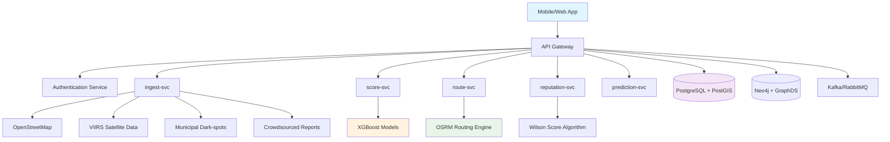

# SafeRoute: AI-Driven Public Safety Navigation System


SafeRoute is an AI-driven public safety navigation system designed for the **Infosys PALS TechZooka Hackathon 2025**. This project focuses on building intelligent navigation for pedestrians and two-wheeler riders in Indian cities, prioritizing safety over speed.

## 🏆 Hackathon Achievement

**Winner - Infosys PALS TechZooka Hackathon 2025**

Our team, **SafeGuard Navigators**, developed an innovative solution that addresses India's severe road safety crisis by creating an intelligent navigation platform that prioritizes personal safety over speed for vulnerable road users.

## 🎯 Problem Statement

India faces a severe and escalating road safety crisis, with statistics painting a grim picture of the daily risks faced by citizens. The problem is particularly acute for pedestrians and two-wheeler riders, who are disproportionately affected.

### Key Statistics:
- **4,61,312 Road Accidents** (2022) resulting in **1,68,491 deaths**
- **65% of fatalities** are vulnerable road users (45% two-wheelers, 20% pedestrians)
- **43% of pedestrian deaths** and **38% of two-wheeler deaths** in Delhi occur at night
- **4,289 "dark spots"** officially identified in Delhi, creating a perception and reality of unsafe routes

## 💡 Solution Overview

SafeRoute addresses this critical gap by designing an intelligent navigation platform that prioritizes user safety through:

1. **Real-time lighting assessment** using VIIRS satellite data
2. **Crowdsourced hazard reporting** with trust-weighted reputation system
3. **Integration with civic infrastructure** for dark-spot identification
4. **Multi-factor SafetyScore algorithm** combining lighting quality, footfall activity, hazard reports, and proximity to help
5. **DPDP Act 2023 compliance** with explicit consent flows and user rights mechanisms

## 👥 Team Members

### Pranava Kumar - Team Lead & Full-Stack Developer
- Overall project architecture
- AI/ML implementation
- Geospatial systems

## 🛠️ Technology Stack

### Frontend
- **Next.js 15+** with App Router
- **React 19+** with Server Components
- **TypeScript 5+**
- **Tailwind CSS v4+**
- **Shadcn UI** & **Magic UI**
- **Framer Motion** for animations
- **Leaflet** for maps
- **Lucide React** for icons

### Backend
- **FastAPI** (Python) for ML services
- **NestJS** (TypeScript) for microservices
- **PostgreSQL + PostGIS** for geospatial data
- **Redis** for caching
- **Kafka/RabbitMQ** for event streaming
- **OSRM** for route optimization

### AI/ML
- **XGBoost/LightGBM** for safety prediction
- **PyTorch** for deep learning models
- **Wilson Score** for reputation system

### Data Sources
- **VIIRS Black Marble** satellite data (NASA)
- **OpenStreetMap** + **Mappls SDK**
- **Municipal dark-spot inventories**
- **India Meteorological Department**
- **Crowdsourced safety reports**

## 🚀 Key Features

### Multi-Factor SafetyScore Algorithm
SafeRoute's proprietary Safety Score algorithm evaluates road safety by combining four key factors:
- **Lighting Quality** (30% weight)
- **Footfall & Activity** (25% weight)
- **Hazard Index** (20% weight)
- **Proximity to Help** (25% weight)

### Trust-Weighted Crowdsourcing
Community-driven safety intelligence with a Wilson score-based reputation system that effectively filters noisy/malicious reports while building a trustworthy safety network.

### Emergency Response Integration
Sub-3-second emergency activation with 112 India integration, location sharing, and emergency contact notification.

### Route Optimization
Safety-first routing that balances travel time with safety, offering multiple route options (safest, fastest, balanced).

### Real-time Safety Updates
Dynamic safety scoring with temporal decay that adapts to changing conditions in real time.

## 🔐 Privacy & Compliance

### DPDP Act 2023 Compliance
- Explicit consent flows for all data processing activities
- Data minimization principles with coarse geo-hashing
- On-device processing for sensitive analyses
- India data residency requirements
- User rights mechanisms (access, correction, deletion)

### Security Features
- JWT with refresh tokens for authentication
- bcrypt hashing for password security
- Rate limiting and brute force protection
- Input validation and output sanitization

## 📊 Measurable Impact

- **25% reduction** in low-lit/isolated segment exposure
- **+30% improvement** in self-reported safety perception
- **Sub-3-second** 112/SOS activation with location context
- **90% report verification rate** through trust-weighted crowdsourcing

## 🗺️ Architecture Overview



## 🚀 Getting Started

### Prerequisites

Before you begin, ensure you have the following installed:
- **Node.js 16+** (LTS recommended)
- **Python 3.8+**
- **PostgreSQL 13+** (or NeonDB account)
- **Git**
- **OSM Data** (Chennai region recommended)
- **OSRM Backend** (v5.24.0+ recommended)

### Installation

1. Clone the repository:
   ```bash
   git clone https://github.com/safeguard-navigators/safeguard-navigators.git
   cd safeguard-navigators
   ```

2. Install frontend dependencies:
   ```bash
   npm install
   ```

3. Set up the backend:
   ```bash
   cd backend
   python -m venv .venv
   .venv\Scripts\activate  # On Windows
   # source .venv/bin/activate  # On macOS/Linux
   pip install -e .
   cd ..
   ```

4. Configure environment variables:
   ```bash
   cp .env.example .env
   # Edit .env with your actual API keys and database URLs
   ```

5. Set up the database:
   ```bash
   npm run setup-db
   ```

6. Download OSM data:
   - Visit https://download.geofabrik.de/asia/india.html
   - Download Chennai region data
   - Place `chennai-latest.osm.pbf` in the `backend` directory and rename to `chennai.osm.pbf`

7. Install OSRM:
   - Download from https://github.com/Project-OSRM/osrm-backend/releases
   - Extract to `OSRM` directory in project root

8. Start all services:
   ```bash
   start-all.bat  # On Windows
   # ./start-all.sh  # On macOS/Linux
   ```

### Simplified Startup (No Auto Package Installation)

The new startup scripts no longer automatically install packages or activate virtual environments:

1. **Manual Setup Required**:
   - Create and activate virtual environment manually
   - Install dependencies manually with `pip install -e .`
   - Ensure all environment variables are properly configured

2. **Service Startup**:
   - Services start in separate windows for easier monitoring
   - Each service can be stopped independently
   - Reduced complexity and fewer automatic operations

### Running without Docker

This project is configured to run without Docker by default. It uses:
- NeonDB as the database (configured in `.env`)
- Local OSRM installation for routing
- Local development servers for frontend and backend

### Available Scripts

- `npm run dev` - Start development server
- `npm run build` - Create production build
- `npm run start` - Start production server
- `npm run lint` - Run linter
- `npm run test` - Run tests

## 📚 Documentation

- [API Documentation](./docs/api.md)
- [Architecture Guide](./docs/architecture.md)
- [Deployment Guide](./docs/deployment.md)
- [Contributing Guide](./CONTRIBUTING.md)

## 🤝 Contributing

We welcome contributions from the community! Please read our [Contributing Guide](./CONTRIBUTING.md) for details on our code of conduct and the process for submitting pull requests.

## 📄 License

This project is licensed under the MIT License - see the [LICENSE](./LICENSE) file for details.

## 🙏 Acknowledgments

- **Infosys PALS TechZooka Hackathon 2025** for the opportunity to build this solution
- **NASA** for the VIIRS Black Marble satellite data
- **OpenStreetMap** for the open mapping data
- **Mappls** for the Indian address precision SDK
- **India Meteorological Department** for weather data APIs

---
Built with ❤️ by the **SafeGuard Navigators** team for the Infosys PALS TechZooka Hackathon 2025
